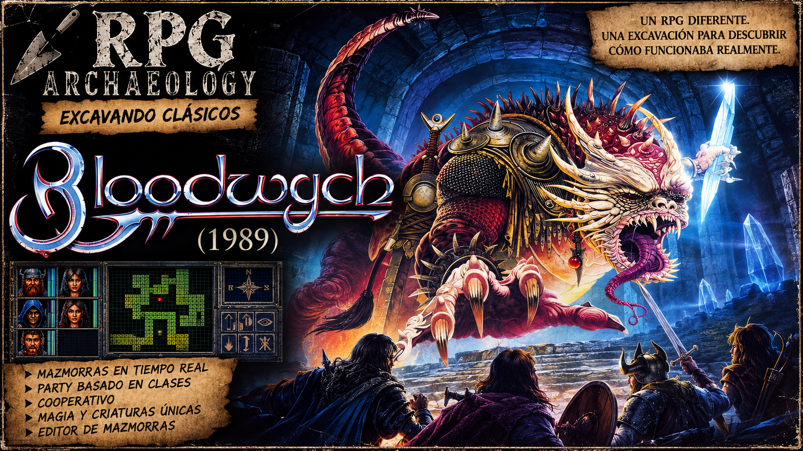

# **Bloodwych (1989) — RPG Archaeology**

<figure markdown>

</figure>

[▶ Ver episodio en YouTube](https://youtu.be/-Ak-0UIx-I0)

**Ficha de arqueología de diseño, sistemas y herramientas**

Objetivo: conservar una segunda fuente de información reutilizable para futuras decisiones de diseño y arquitectura en *Lands of Folklore* (LoF), especialmente en ámbitos de dungeon authoring, party, inventario, combate, magia, interacción sistémica, multiplayer y tooling.

Esta ficha no pretende reconstruir al 100% el código original ni documentar cada contenido del juego. Se centra en decisiones de diseño y estructuras verificables que puedan ser útiles como referencia comparativa.

## **1\. Resumen ejecutivo**

*Bloodwych* resulta especialmente interesante por combinar, ya en 1989:

> * exploración de dungeon en primera persona y tiempo real;  
> * party de campeones individualizados;  
> * cooperativo simultáneo a pantalla partida;  
> * inventarios y estadísticas individuales;  
> * formación táctica dentro de una celda;  
> * conversación/comercio mediante una interfaz compacta;  
> * magia y progresión con varias capas;  
> * monstruos presentes físicamente en el dungeon;  
> * mundo mutable mediante switches y triggers;  
> * representación espacial extremadamente compacta;  
> * un modelo de autoría que, pese a no haberse diseñado originalmente como editor moderno, pudo ser reconstruido por la comunidad.

La conclusión principal es que *Bloodwych* no intenta simular un mundo mediante física continua. Su expresividad proviene de:  
**pocos estados discretos \+ reglas consistentes \+ referencias compartidas \+ acciones concretas sobre el dungeon.**  
Esto lo convierte en una referencia especialmente útil para LoF, cuyo mundo también se apoya en grid, estados discretos y separación entre estructura editorial y ejecución runtime.

## **2\. Fuentes principales consultadas**

### **Código / resourcing**

> * Repositorio de resourcing:  
>   https://github.com/HoraceAndTheSpider/Bloodwych-68k  
> * Documentación del editor reconstruido:  
>   docs/map-editor.md  
>   docs/ui-layout.md  
>   docs/dungeon-graphics.md  
>   docs/resource-layouts.md  
> * Herramientas de reconstrucción:  
>   tools/map\_editor/model.py  
>   tools/map\_editor/semantics.py  
>   tools/monster\_view.py  
>   tools/champion\_stats\_scroll.py  
>   tools/spellbook.py  
> * Editor comunitario AMOS archivado en el repo:  
>   \_archive/AMOS code/BloodwychEditor2-7\_025.txt  
>   \_archive/AMOS code/BloodwychEditor2-7\_026.txt

### **Comunidad / documentación histórica**

> * Ultimate Amiga:  
>   Hacking / data structure guides  
>   Bloodwych editor y modificaciones  
>   notas de source/disassembly  
> * Lemon Amiga / Lemon64:  
>   manuales y reviews  
> * CRPG Addict:  
>   análisis de diseño y experiencia de juego  
> * Amiga Reviews:  
>   reviews contemporáneas y retrospectivas

## **3\. Estado de confianza**

Para esta ficha se usan tres niveles:

> * **CONFIRMED** — respaldado por el resourcing, herramientas reconstruidas o datos binarios interpretados de forma explícita.  
> * **STRONG** — coherente con varias fuentes o con comportamiento observado, pero no seguido aún hasta la rutina concreta.  
> * **OPEN / UNKNOWN** — afirmación interesante todavía no cerrada con suficiente evidencia.

# **PARTE 0 — EL FACTOR HUMANO Y LA PRODUCCIÓN**

## **3.1. Los Autores: "La Trinidad de Trazere"**

!!! success "CONFIRMED"
    *Bloodwych* no fue producto de un gran estudio, sino el esfuerzo central de tres personas que operaban bajo fuertes restricciones técnicas y de memoria.

    > * **Anthony "Tag" Taglione (Programación 16-bits y Diseño):** Motor técnico del juego. Escribió el motor en ensamblador 68000 para Amiga y Atari ST. Su motivación original era trasladar sus partidas de tablero de *Dungeons & Dragons* al ordenador para jugar con su compañero Pete James. Al ver *Dungeon Master*, decidieron que la única forma de superarlo era construir un motor que soportara dos instancias del mundo renderizándose simultáneamente.
    > * **Pete James (Arte y Diseño de Niveles):** Amigo de universidad de Anthony. Responsable de la optimización visual extrema. Diseñó un set de *tiles* lo suficientemente modular y ligero como para que el motor pudiera dibujar dos vistas en primera persona sin colapsar la RAM de las máquinas de la época.
    > * **Philip Taglione (Programación 8-bits):** Hermano menor de Anthony. Ante la exigencia de la editora (Mirrorsoft) de lanzar el juego en sistemas menores, reescribió y adaptó toda la lógica y arquitectura al ensamblador Z80 (ZX Spectrum, Amstrad CPC).

### **Lección conceptual**

La arquitectura de *Bloodwych* (datos ultra-comprimidos, tipos de celda discretos) no fue un capricho teórico, sino una **respuesta directa a la necesidad de mantener dos estados de jugador y dos renderizados simultáneos** en máquinas con 512KB de RAM.

## **3.2. Lección de Producción A: La pérdida de control del Runtime**

!!! success "CONFIRMED"
    El núcleo del equipo desarrolló internamente las versiones de Amiga, Atari ST, Spectrum, Amstrad y Commodore 64\. Sin embargo, la editora externalizó el *port* de MS-DOS (PC) a un estudio externo llamado Walking Circles.
    El resultado fue un desastre técnico: la versión de PC se lanzó con *bugs* críticos que corrompían la partida, rompían los *switches* y hacían el juego literalmente imposible de terminar.

### **Principio extraído para LoF**

**El Runtime es sagrado. No se delega el core sin control absoluto.**  
Si en el futuro LoF requiere *ports* o integraciones con sistemas externos (APIs, plataformas, consolas), el equipo original debe auditar la lógica de estado. Delegar la responsabilidad del *engine* sin contratos claros de arquitectura destruye la experiencia del jugador, sin importar lo bueno que sea el diseño de niveles.

## **3.3. Lección de Producción B: Scope fluido pero verificado**

!!! tip "STRONG"
    La portada del juego fue encargada al ilustrador Chris Achilleos con total libertad creativa. Achilleos entregó una pintura protagonizada por un enorme demonio de cristal. Al equipo le gustó tanto el arte que, en lugar de ignorarlo, volvieron al código y adaptaron el diseño final del juego para incluir a esa criatura exacta como el jefe final: *El Señor de la Entropía*.

### **Principio extraído para LoF**

**Permeabilidad controlada de assets.**  
Aunque la regla general en LoF sea *"No amplío el scope sin permiso"*, el diseño debe ser lo bastante modular como para que, si surge un *asset* excepcional (un modelo 3D, una pieza musical, un arte conceptual), el sistema de *Data Model* permita integrarlo (crear un nuevo *Monster Record* o *Event Trigger*) sin obligar a reescribir el código base. El motor consume datos; si el dato es bueno, el motor debe poder asimilarlo sin fricción.

# **PARTE I — EL DUNGEON COMO MODELO DE DATOS**

## **4\. Recurso de mapa por torre**

!!! success "CONFIRMED"
    Cada torre de *Bloodwych* posee un recurso fijo de:

    > * 0x1000 bytes por mapa de torre;
    > * cabecera de 0x38 bytes;
    > * hasta 8 plantas;
    > * el resto (0xFC8) contiene las celdas.

    Cada localización ocupa exactamente:

    2 bytes

    La cabecera guarda, entre otras cosas:

    > * 8 anchuras;
    > * 8 alturas;
    > * 8 offsets de datos;
    > * 8 offsets/alineamientos X;
    > * 8 offsets/alineamientos Y;
    > * información de planta especial;
    > * número de planta superior.

    Esto permite que distintas plantas:

    > * tengan dimensiones distintas;
    > * estén desplazadas unas respecto a otras;
    > * se relacionen verticalmente sin necesitar una representación 3D continua.

### **Lección**

Un dungeon multinivel no necesita ser un volumen 3D completo. Puede ser:

Floor 0 \-\> grid 2D \+ alignment  
Floor 1 \-\> grid 2D \+ alignment  
Floor 2 \-\> grid 2D \+ alignment  
...

y las conexiones verticales se resuelven mediante la relación entre grids.

## **5\. Anatomía de una celda**

!!! success "CONFIRMED"
    Los dos bytes de cada celda se exponen en el editor como cuatro nibbles:

    Byte 0
      A \= bits 7..4
      B \= bits 3..0

    Byte 1
      C \= bits 7..4
      D \= bits 3..0

    Los tres bits inferiores determinan:

    map\_type \= second\_byte & 0x07

    Por tanto hay exactamente **8 tipos fundamentales de celda**.
    La semántica del resto de bits depende del tipo. Esto equivale a una variant/union extremadamente compacta.

# **PARTE II — LOS 8 TIPOS DE CELDA**

## **6\. Type 0 — Space**

!!! success "CONFIRMED"
    Representa espacio libre/transitable.
    Default semántico:

    00 00

    Su función principal es establecer que una posición del dungeon puede existir sin contener ninguna estructura especial.

### **Lectura conceptual**

EMPTY / WALKABLE SPACE

## **7\. Type 1 — Stone Wall \+ Feature**

!!! success "CONFIRMED"
    No representa únicamente un muro de piedra.
    Puede almacenar:

    > * cara/orientación;
    > * estado especial;
    > * uno de varios tipos de wall feature.

    Familias documentadas:

    SHELF
    SIGN
    SWITCH
    SOCKET

    Los switches pueden tener:

    > * referencia;
    > * estado visual (LIT / DIM).

    Los sockets pueden tener:

    > * familia de gema;
    > * estado FULL / EMPTY.

    Los signs pueden representar:

    > * signos temáticos;
    > * scrolls/referencias.

    También existe un estado de ocultación/conceal.

### **Lectura conceptual**

STRUCTURAL MASS  
      \+  
WALL-MOUNTED FEATURE

### **Comparación con LoF**

Bloodwych comprime dentro de la celda lo que LoF tiende a separar conceptualmente como:

StructuralEdge  
\+  
Placed / Interactive Feature

## **8\. Type 2 — Wooden Structure**

!!! success "CONFIRMED"
    Una sola celda puede representar independientemente los cuatro lados:

    N
    E
    S
    W

    Cada lado usa dos bits y admite:

    NONE
    WALL
    OPEN
    CLOSED

    Además puede existir un estado de lock.
    Ejemplo conceptual:

    N \= WALL
    E \= OPEN
    S \= NONE
    W \= CLOSED

### **Lectura conceptual**

Es una forma ultracomprimida de:

Cell  
  Edge N  
  Edge E  
  Edge S  
  Edge W

### **Relevancia para LoF**

Es una referencia histórica directa para el mismo tipo de problema que LoF resuelve mediante StructuralEdge.  
Bloodwych integra los edges en la celda por necesidad de compresión. LoF los extrae como entidades editoriales explícitas para ganar claridad y extensibilidad.

## **9\. Type 3 — Misc Solid**

!!! success "CONFIRMED"
    Agrupa al menos:

    BED
    PILLAR

    Esta clasificación puede parecer extraña desde una ontología moderna, pero probablemente refleja una decisión funcional:
    ambos son elementos especiales ocupando la celda y procesados de forma similar por el motor.

### **Lección arqueológica**

Las categorías de datos históricas no siempre describen “qué es una cosa” en el mundo. A menudo describen:  
**qué rutina del motor necesita procesarla.**

## **10\. Type 4 — Stairs**

!!! success "CONFIRMED"
    Codifica:

    Elevation: UP / DOWN
    Direction: N / E / S / W

    No necesita almacenar necesariamente un destino completo en la propia celda. La relación vertical depende del layout/alineamiento de las plantas.

### **Lectura conceptual**

VERTICAL CONNECTION

## **11\. Type 5 — Metal Door**

!!! success "CONFIRMED"
    La puerta metálica es categoría propia. Puede definir:

    REGULAR / PORTCULLIS
    NORTH-SOUTH / EAST-WEST
    OPEN / CLOSED
    LOCK TYPE

    Familias de cerradura documentadas por el editor reconstruido:

    UNLOCKED
    MAGE
    BRONZE
    IRON
    SERPENT
    CHAOS
    DRAGON
    MOON
    CHROMATIC
    VOID

### **Lección de diseño**

Una cerradura no tiene por qué representar simplemente requires\_key \= true. Puede ser un punto de conexión con otros sistemas: progresión, magia, facción, escuela, objeto, estado global.

### **Comparación con LoF**

Bloodwych: Door \= Cell Type  
LoF: Door \= StructuralEdge(kind \= DOOR)

## **12\. Type 6 — Floor / Event Surface**

!!! success "CONFIRMED"
    Puede representar:

    FIZZLE
    FLOOR HOLE
    GREEN PAD
    INVISIBLE PAD

    Y además, de forma independiente:

    CEILING HOLE
    NO CEILING HOLE

    Los pads pueden contener una referencia a una tabla de triggers. Ejemplo:

    Cell:
      invisible pad
      trigger\_ref \= 17
      ceiling\_hole \= true

### **Lectura conceptual**

FLOOR / SURFACE STATE  
      \+  
EVENT REFERENCE

### **Relevancia para LoF**

Es un ejemplo claro de mundo reactivo sin física continua. Una celda puede poseer estados discretos y referencias a comportamiento.

## **13\. Type 7 — Magic Space**

!!! success "CONFIRMED"
    Estados documentados:

    SPACE
    FIREPATH
    MINDROCK
    FORMWALL

    Más:

    POWER \= 0..63

### **Lección de diseño**

Ciertos efectos mágicos se modelan como **propiedades del espacio**, no necesariamente como actores separados.  
Esto resulta relevante para futuras ideas de LoF como: burning, flooded, frozen, poisoned, corrupted, anti\_magic, smoke.  
El punto importante no es copiar el modelo, sino recordar que: **el estado de una celda puede ser parte activa de la simulación.**

# **PARTE III — EL VOCABULARIO ESPACIAL**

## **14\. Clasificación abstracta**

Si se eliminan los nombres específicos del juego, los 8 tipos representan aproximadamente:

0  EMPTY SPACE  
1  STRUCTURAL MASS \+ FEATURE  
2  PER-SIDE STRUCTURE  
3  CELL OCCUPANT / SOLID FEATURE  
4  VERTICAL CONNECTION  
5  PASSAGE BARRIER  
6  FLOOR / EVENT SURFACE  
7  ENVIRONMENTAL / MAGIC STATE

Esta abstracción es más importante que los nombres concretos. Bloodwych tuvo que responder, bajo una restricción extrema: “¿Cuáles son las formas fundamentales en las que una posición del dungeon puede participar en el juego?”  
La restricción de 3 bits obligó a definir un vocabulario espacial muy pequeño y muy explícito.

### **Posible ejercicio futuro para LoF**

Sin necesidad de imponer un límite de ocho: ¿Cuáles son las responsabilidades fundamentales de StructuralCell, StructuralEdge y PlacedInstance?  
No para crear enums gigantes, sino para detectar mezclas de responsabilidad.

# **PARTE IV — SWITCHES**

## **15\. Estructura de un switch**

!!! success "CONFIRMED"
    Una celda Type 1 puede contener un switch. La celda no almacena directamente su comportamiento. Almacena una referencia a una definición compartida.

    STONE WALL CELL
          |
          \+-- SWITCH
                 |
                 \+-- reference
                        |
                        v
                  SwitchRecord
                  \------------
                  action
                  target X
                  target Y

    Cada torre dispone de:

    16 switch definitions
    4 bytes each

## **16\. Acciones de switch**

!!! success "CONFIRMED"
    El editor reconstruido identifica estas acciones:

    0x00  NO EFFECT
    0x02  REMOVE
    0x04  TOGGLE WALL
    0x06  OPEN METAL DOOR
    0x08  ROTATE WALL
    0x0A  TOGGLE PILLAR
    0x0C  PLACE PILLAR
    0x0E  ROTATE WOODEN WALL

    No hay un lenguaje de scripting general. Hay un vocabulario reducido de **verbos conocidos sobre el mundo**.

## **17\. Modelo conceptual de interacción**

ACTIVATOR  
   |  
   v  
REFERENCE  
   |  
   v  
ACTION \+ TARGET  
   |  
   v  
WORLD STATE TRANSITION

Ejemplo:

Switch \#3  
  action \= OPEN METAL DOOR  
  target \= (14,8)

## **18\. Verbos del dungeon**

El lenguaje de switches puede reducirse a: OPEN, REMOVE, TOGGLE, ROTATE, PLACE.  
Esta simplicidad permite construir puertas remotas, muros secretos, pilares móviles, mecanismos giratorios, cambios de conectividad, puzzles espaciales.

### **Lección principal**

Antes de introducir scripting generalista: **comprobar cuánto dungeon puede construirse con un conjunto pequeño de Commands sobre estados conocidos.** Esto es especialmente relevante para LoF, que ya utiliza Commands en su arquitectura editorial.

## **19\. Reutilización de referencias**

!!! success "CONFIRMED"
    Varias celdas pueden compartir el mismo SwitchRecord.

    Switch A \--\\
    Switch B \----\> SwitchRecord \#7
    Switch C \--/

### **Lección para LoF**

Cuando un Inspector modifique un recurso compartido: **la UI debe comunicar que la modificación afecta a más de una instancia.** Aplicable a materiales, interaction profiles, actor definitions, shared behaviours, reusable resources, event definitions.

# **PARTE V — TRIGGERS**

## **20\. Diferencia conceptual entre switch y trigger**

!!! success "CONFIRMED"
    Switch:

    action
    x
    y

    Trigger:

    action
    floor
    x
    y

    El switch funciona como mecanismo espacial relativamente local. El trigger es una herramienta de evento más general y puede afectar explícitamente a otra planta.

## **21\. Acciones conocidas de trigger**

El resourcing documenta un vocabulario mucho más amplio:

NO EVENT, SPINNER 1, SPINNER 2, OPEN METAL DOOR, VIVIFY, WOOD DOOR TRAP, TRADER DOOR, TOWER ENTRANCE, REMOVE, CLOSE METAL DOOR, TOGGLE PILLAR, CREATE PAD, CREATE WALL... (entre otros)

### **Lectura conceptual**

Los triggers cruzan la frontera entre MECHANISM y EVENT SYSTEM. Permiten modificar geometría, mover/crear elementos, teletransportar, cambiar datos, entrar en torres, condiciones especiales, etc.

# **PARTE VI — PARTY Y CAMPEONES**

## **22\. Party como contenedor operativo**

**CONFIRMED en estructura general.**  
Bloodwych no destruye la individualidad de los campeones. Cada campeón mantiene identidad, profesión, stats, HP, Vitality, Spell Points, hechizos, inventario, equipamiento, posición, orientación, estados.  
Pero el jugador opera sobre ellos desde una capa de party común.

PLAYER \-\> PARTY \-\> \[CHAMPION, CHAMPION, ...\]

## **23\. Subposiciones dentro de una celda**

!!! success "CONFIRMED"
    Existen cinco subposiciones: 0 near right, 1 near left, 2 rear left, 3 rear right, 4 centre

### **Lección**

Un sistema grid-based puede tener **microespacio táctico** sin abandonar el grid.

## **24\. Champion Record**

**CONFIRMED en los campos ya reconstruidos**  
Separación clara de Level, Attributes, Resource Pools, Knowledge, Equipment, Position. No todo se reduce a “class \+ level”.

# **PARTE VII — INVENTARIO**

## **25\. Inventario individual**

!!! success "CONFIRMED"
    Cada campeón mantiene inventario propio (12 slots visibles).

    Party control \= shared operational layer
    Inventory \= individual ownership

## **26\. Stats derivados**

!!! success "CONFIRMED"
    La protección final combina valor base \+ equipo \+ estados \+ armour de manos \+ shield.

### **Lección para LoF**

Preferir, cuando tenga sentido, stats derivados de fuentes explícitas frente a almacenar el mismo resultado final en múltiples sitios.

# **PARTE VIII — MAGIA Y PROGRESIÓN**

## **27-30. Magia y Level-up**

!!! success "CONFIRMED"
    Los 32 hechizos se representan mediante flags individuales. El conocimiento se almacena por individuo. Existe además una matriz runtime separada de spell practice.
    La contribución del level al casting varía según profesión. El mismo Level se interpreta mecánicamente de forma distinta dependiendo del personaje.

# **PARTE IX — COMUNICACIÓN Y AGENCIA**

## **31\. Comunicación en tiempo real**

!!! tip "STRONG"
    Bloodwych integra comunicación, comercio e interacción dentro de la misma interfaz del juego (trade, threaten, bribe, praise, etc.). Es compacto y compatible con el tiempo real.

## **32\. Agencia de compañeros**

!!! tip "STRONG"
    Las interacciones sociales influyen en la autonomía de los miembros. Un companion podría mantener un pequeño conjunto de tendencias (loyalty, confidence, aggression) como modificadores de microdecisiones.

# **PARTE X — MULTIPLAYER**

## **33\. Multiplayer como requisito estructural**

**CONFIRMED a nivel de diseño general**  
Bloodwych soporta dos jugadores simultáneos. Cada lado mantiene estado de jugador propio y una región de interfaz independiente.

## **34\. Qué NO implica esto para LoF**

La política razonable para LoF es single-player product, pero avoid gratuitous assumptions that make multiple players impossible. El networking, si algún día existe, debe considerarse post-development.

# **PARTE XI — EL EDITOR COMUNITARIO**

## **35\. No es sólo un editor de mapas**

!!! success "CONFIRMED"
    El editor AMOS comunitario llegó a manejar referencias y datos para torres, switches, monsters, stats, etc. Advertencia clásica de scope creep en tooling.

## **36\. Modos del editor moderno**

Diferentes responsabilidades del mundo necesitan **diferentes modos de authoring**. No todo debe editarse mediante el mismo panel o herramienta.

## **37\. Raw View \+ Semantic View**

Una herramienta avanzada puede ofrecer semantic authoring \+ raw diagnostics sin obligar al usuario a trabajar permanentemente al nivel binario.

## **38\. Defaults válidos al cambiar de tipo**

Una transformación editorial debería producir un estado válido por construcción en lugar de acumular residuos semánticos invisibles. Muy relevante para Inspectors en LoF.

## **39\. Original vs Modified**

El editor moderno nunca sobrescribe el recurso clean. Separar claramente: source, working state, generated/modified output.

## **40\. Dirty Resources**

El editor mantiene seguimiento de torres/recursos dirty. Sólo se escriben los modificados.

## **41\. Overlays editoriales**

Switches y triggers pueden visualizarse como overlays. La idea para LoF es: **múltiples lentes sobre el mismo documento editorial.**

## **42\. Preview first-person**

El preview de authoring de Bloodwych no respeta las collision rules del juego, porque la navegación de authoring y la navegación runtime son responsabilidades distintas.

# **PARTE XII — PRINCIPIOS EXTRAÍDOS PARA LOF**

## **43\. Estado discreto como alternativa a física**

Un dungeon puede ser sistémico sin ser un immersive sim de física continua. Filosofía para LoF: **Dungeon crawler sistémico**.

## **44\. Problema, no solución obligatoria**

Una clase o capacidad no debería ser necesariamente una llave única (ej. LOCKED DOOR se puede abrir con lockpick, break, spell, key).

## **45\. Vocabulario pequeño antes de scripting**

Evaluar cuánto contenido puede expresarse mediante Commands semánticos y estados bien definidos antes de introducir scripting generalista.

## **46\. Referencia compartida vs instancia**

El patrón PLACEMENT \-\> REFERENCE \-\> SHARED DEFINITION es muy útil, pero requiere UX explícita cuando se modifica el recurso compartido.

## **47\. Party como unidad operativa sin borrar individuos**

Combinar control a nivel de grupo con el estado individual de cada personaje.

## **48\. Grid \+ subposiciones**

Opción arquitectónica: world movement \= grid y local tactical occupancy \= sub-grid / slots.

## **49\. Authoring Navigation \!= Runtime Navigation**

Un preview debe declarar qué intenta validar. No hay una única definición correcta de “preview”.

## **50\. Editor como colección de lentes**

El mismo documento puede necesitar distintas vistas según la pregunta del autor (Structure View, Navigation View, Interaction View, etc.).

# **PARTE XIII — COSAS NO CERRADAS**

## **51\. Preguntas abiertas**

Combate, IA, Progresión, Social. El retorno de diseño disminuía. Estos puntos quedan como OPEN / OPTIONAL FUTURE EXCAVATION.

# **PARTE XIV — CONCLUSIÓN**

## **52\. Qué representa Bloodwych dentro de RPG Archaeology**

Fórmula conceptual:

SMALL DATA MODEL  
      \+  
CLEAR STATE  
      \+  
REUSABLE REFERENCES  
      \+  
WORLD COMMANDS  
      \+  
CONSISTENT RULES  
      \=  
SYSTEMIC DUNGEON

# **PARTE XV — USO FUTURO EN LOF**

## **53\. Cómo reutilizar esta ficha**

Recuperar como contexto comparativo para futuras features. Prompt recomendado:  
**“Date un rulo por la ficha de Bloodwych de RPG Archaeology y actualiza contexto. Compara las decisiones documentadas allí con el corte/feature actual de LoF. No propongas cambios por analogía automática: identifica únicamente patrones útiles, riesgos, alternativas y diferencias estructurales.”**

## **54\. Recordatorio metodológico**

La función de RPG Archaeology no es copiar soluciones antiguas, es descubrir qué problemas ya fueron resueltos, bajo qué restricciones, con qué costes y qué principios sobrevivieron.  
**STATUS:** Bloodwych excavation — **CLOSED**  
**Possible future revisit:** only for targeted questions with clear value.  
**Next comparative target:** *Forgotten Realms: Unlimited Adventures*.