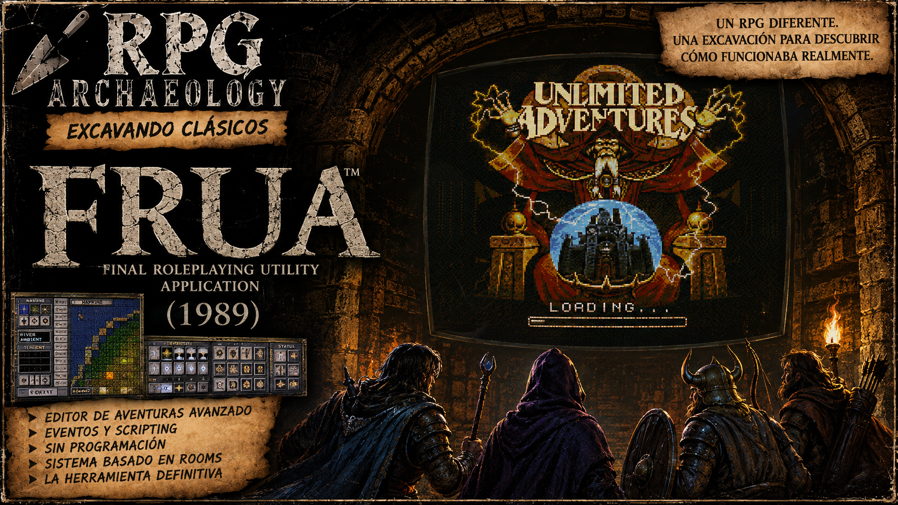

# Unlimited Adventures / Dungeon Craft --- Authoring Architecture, Lessons and Future Questions

> **RPG Archaeology --- Working Reference**
>
> **Scope:** Forgotten Realms: Unlimited Adventures (FRUA), its
> authoring model, community friction, and the later Dungeon Craft / UAF
> response.
>
> **Purpose:** This document is not a specification for Lands of
> Folklore (LoF). It is an archaeological reference intended to preserve
> design questions, historical solutions, failure modes, and possible
> future directions. Its value is to be revisited when a LoF feature or
> architectural cut raises a similar question.


------------------------------------------------------------------------

<figure markdown>

</figure>

[▶ Watch the episode on YouTube](https://www.youtube.com/watch?v=-4GsVs7DFZM)

## 0. The human factor, production and community

### 0.1. The studio and developers: MicroMagic and SSI

!!! success "CONFIRMED"

    Unlike much of the core Gold Box titles developed directly under SSI, Forgotten Realms: Unlimited Adventures was developed by MicroMagic and published by Strategic Simulations, Inc. (SSI).

    The credits identify a relatively small core behind the transformation of Gold Box technology into an adventure creation tool:

    Jason T. Linhart — Lead Design, direction and programming. Central figure in FRUA's design and a member of the programming team responsible for converting Gold Box engine capabilities into an authoring tool usable by non-programmer players and designers.
    David Blake and Bill Sloan — Programming. They formed part of the project's technical core; Sloan is also linked to design and documentation tasks.
    Eric Halloran and Herb Perez — Graphics / Artwork, with Carol Tanguay credited for additional art. The artistic work had to adapt the visual language inherited from Gold Box games to an environment where walls, backgrounds, portraits, sprites and other elements could be used as building pieces.
    David Govett and George “The Fat Man” Sanger — Music, continuing the usual collaboration around the sound technology used by SSI.
    John W. Ratcliff — IBM Digital Sound Driver, specifically credited for this part of the sound infrastructure.
    Clyde Caldwell — Cover art. One of the most recognizable TSR illustrators and responsible for giving FRUA an immediately AD&D-associable commercial identity.

### Archaeological reading

!!! abstract "ARCHAEOLOGICAL READING"

    What is interesting is not only who programmed FRUA, but the type of work this team had to do.

    Previous Gold Box games had been built as closed products: their designers worked with tools and internal structures intended to produce one specific game.

    FRUA required inverting that relationship.

    ``` text
    BEFORE

    Internal tools
            ↓
    SSI designers
            ↓
    Gold Box Game
            ↓
    Player
    ```

    ``` text
    FRUA

    Tools turned into product
            ↓
    Player / Author
            ↓
    Adventure Design
            ↓
    Another player
    ```

    The problem was no longer simply making the engine run an adventure.

    It required that someone outside the team could describe that adventure without needing to understand how the engine worked.

    That is precisely the authoring problem that makes FRUA especially relevant to RPG Archaeology.

### 0.2. Production context: the swan song of the Gold Box era

!!! success "CONFIRMED / STRONG"

    FRUA appeared in 1993, when Gold Box technology was already at the end of a long commercial trajectory that began with Pool of Radiance in 1988.

    Meanwhile, the CRPG was undergoing a rapid technical and visual transformation. Games like Eye of the Beholder and Ultima Underworld had shown very different ways to represent and explore three-dimensional worlds, and Gold Box technology was inevitably beginning to show its age.

    FRUA took much of that technological and content heritage and converted it into a construction set for AD&D adventures.

    The product also included a complete example adventure, The Heirs to Skull Crag, which served both as playable content and as a practical demonstration of what could be built with the tools.

### Archaeological reading

!!! abstract "ARCHAEOLOGICAL READING"

    It is tempting to interpret FRUA simply as the last commercial exploitation of an aging technology.

    But from the tools perspective there is a much more interesting reading:

    A mature runtime can acquire a second life when its capabilities stop being used solely to produce internal content and become a creation language for third parties.

    The change can be represented as:

    ``` text
    ENGINE
      ↓
    GAME
      ↓
    END OF PRODUCT LIFE

    versus:

    ENGINE
      ↓
    AUTHORING TOOL
      ↓
    USER CONTENT
      ↓
    NEW USER CONTENT
      ↓
    NEW USER CONTENT
      ↓
    ...
    ```

    Technology stops producing only products and begins producing content producers.

### Production lesson for LoF

The maturity of a Runtime can increase the value of its authoring tools.

When a motor's rules, capabilities and limits are sufficiently understood, an authoring layer can transform that technical stability into creative capacity for third parties and enormously extend the ecosystem's useful life.

This does not imply that the editor should only appear at the end of the motor's life. In LoF, Editor and Runtime are part of development from much earlier.

The useful lesson is another:

The more stable and understandable the contract between Authoring and Runtime, the more viable it becomes to turn internal motor capabilities into safe tools for external users.

### 0.3. The community ecosystem: from designs to hacks

!!! success "CONFIRMED / STRONG"

    FRUA's longevity depended much less on SSI's official support than on the community that formed around the tool.

    Designs circulated through the online services and communities available at the time and later, around files, webs and specialized forums such as The Magic Mirror, UA File Archive and the communities that eventually converged around Gold Box Games.

    The community did not limit itself to creating adventures.

    It also began to discover the technical and editorial limits of the system.

### Ray Dyer and The Realm

!!! success "CONFIRMED / STRONG"

    One of the most ambitious examples of FRUA's potential was the work of Ray Dyer, responsible for The Realm.

    Dyer produced a huge collection of designs based on classic Dungeons & Dragons modules, building around forty related adventures and an environment that allowed browsing and selecting different modules.

    From our analysis it is especially interesting because The Realm attacked precisely one of the conceptual limitations we have identified in FRUA.

    The product understood well:

    ``` text
    MODULE
        ↓
    ADVENTURE DESIGN
    ```

    but provided a much less powerful abstraction above multiple Adventures.

    The community ended up approximating something like:

    ``` text
    THE REALM
        │
        ├── Adventure
        ├── Adventure
        ├── Adventure
        ├── Adventure
        └── ...
    ```

    That is:

    users began to build, through conventions and content, a Campaign layer that the tool did not formally provide with the same richness.

    This is a recurrent pattern in authoring tools:

    when many users repeatedly build the same abstraction above the tool, there may be an absent editorial concept below.

### 0.4. When authors crossed the Runtime Boundary

!!! success "CONFIRMED"

    FRUA allowed modifying a large amount of content, but kept other parts of the game enclosed within the structures and constants of the executable.

    When the community wanted to modify what SSI had not considered part of the authoring language, reverse engineering began.

    Tools and techniques appeared around:

    CKIT.EXE;
    executable patches;
    worldhacks;
    internal table modification;
    alterations of classes, races, objects and rules;
    graphical modifications beyond the originally intended limits.

    A particularly important piece of this ecosystem was UAShell.

    Instead of necessarily distributing fully modified executables, hacked designs could use files like DIFF.TBL, which described differences to be applied to the local copy of CKIT.EXE.

    Conceptually:

    ``` text
    ORIGINAL CKIT.EXE
           +
        DIFF.TBL
           ↓
    MODIFIED LOCAL RUNTIME
    ```

    This allowed the community to extend FRUA much beyond the capabilities envisioned by SSI.

    But it had a cost.

    ``` text
    FRUA
     ↓
    simple authoring model
     ↓
    hard limits
     ↓
    community hacks
     ↓
    greater freedom
     ↓
    external tools
     ↓
    patches
     ↓
    compatibility requirements
     ↓
    greater technical complexity
    ```

    The community regained extensibility, but part of the original simplicity inevitably began to disappear.

### 0.5. From UA2000 to UA Forever and Dungeon Craft

!!! success "CONFIRMED / STRONG"

    At the end of the nineties, a much more ambitious attempt to solve the problem appeared: to rebuild the idea of Unlimited Adventures on a modern platform instead of indefinitely extending the original DOS executable.

    The early history of the project records:

    ``` text
    1999
      ↓
    UA2000
      ↓
    UA Forever
      ↓
    UAF
      ↓
    Dungeon Craft
    ```

    The project was already documented in August 1999 and shortly after adopted the name UA Forever. Sources from that early stage identify Robert Turner among the figures of the project.

    Over time, UA Forever evolved toward Dungeon Craft, maintained and expanded by different community members for many years.

    Later developers and collaborators —including names strongly associated with the modern history of the project like CocoaSpud and Manikus— continued to expand its capabilities.

    The objective stopped being simply hacking FRUA.

    It became:

    recreate and extend the concept of Unlimited Adventures without being limited by the closed structures and technical restrictions of the original executable.

    Dungeon Craft would end up allowing much higher levels of customization in areas such as:

    ``` text
    classes
    races
    items
    monsters
    spells
    special abilities
    databases
    scripting
    art
    ```

    But, as we have seen in the rest of this sheet, that freedom also considerably increased the conceptual surface that a designer had to understand.

### 0.6. The full cycle

!!! abstract "ARCHAEOLOGICAL SYNTHESIS"

    The human history of FRUA can be summarized through an extraordinarily useful cycle:

    ``` text
    SSI / MICROMAGIC
    create a limited authoring language
                │
                ▼
    USERS
    learn that language
                │
                ▼
    CREATE CONTENT
                │
                ▼
    DISCOVER ITS LIMITS
                │
                ▼
    WANT TO EXPRESS MORE
                │
                ▼
    HACKS / UASHELL / REVERSE ENGINEERING
                │
                ▼
    GREATER FREEDOM
                │
                ▼
    GREATER COMPLEXITY
                │
                ▼
    UA FOREVER / DUNGEON CRAFT
                │
                ▼
    NEW AUTHORING MODEL
    with a much more open boundary
    ```

    It is not simply the story of a game that survived thanks to its fans.

    It is also the story of decades-long negotiation about where the boundary between the creator of a tool and the creator of content should be placed.

### 0.7. Principle extracted for LoF

!!! abstract "ARCHAEOLOGICAL READING"

    FRUA's experience allows us to reformulate one of the main conclusions of this research:

    The community will try to cross the Runtime Boundary when it perceives as creative content something that the engine keeps enclosed in constants.

    The answer does not necessarily have to be opening the Runtime.

    In fact, FRUA demonstrates that those are two different questions:

    ``` text
    IMPLEMENTATION
    Raycaster
    Navigation
    Renderer
    Runtime state machines
    Execution
            │
            │  LoF responsibility
            ▼
    ═══════════════════════════════
            RUNTIME BOUNDARY
    ═══════════════════════════════
            ▲
            │  potentially authorable
            │
    GAME DEFINITION
    Creatures
    Items
    Spells
    Classes
    Events
    Quests
    World
    ...
    ```

    The important question is not:

    Should we allow the user to modify the Runtime?

    The question is:

    What concepts does the user legitimately consider part of their creative language?

    If those concepts are kept as authorable data through clean mechanisms —for example, typed `.tres` Resources— the need to resort to reverse-engineering the binary decreases, and the risk of fragmenting the ecosystem through incompatible hacks is reduced.

### Design principle

Private Runtime; extensible creative language.

LoF should try to keep under its responsibility the machinery that runs the game, while deliberately deciding which data and domain concepts can belong to the author.

FRUA demonstrates the danger of closing that boundary too much.

Dungeon Craft demonstrates the opposite danger of opening it until the system's entire complexity reaches the user.

The interesting problem for LoF is found exactly between both extremes.

------------------------------------------------------------------------

## 1. Why FRUA matters to RPG Archaeology

Forgotten Realms: Unlimited Adventures is especially relevant because
its objective is unusually close to one of the long-term ambitions
behind LoF:

> **Give users a tool for making RPG adventures, not a programming
> environment.**

The interesting question is therefore not merely how FRUA represented
maps, combat, inventory, or AD&D rules. The more useful question is:

> **How did SSI expose enough of an RPG to let non-programmers author
> adventures while keeping the machinery of the engine out of their
> way?**

The later history of the FRUA community and Dungeon Craft makes the case
even more valuable. It provides something close to a longitudinal
experiment:

``` text
FRUA
  ↓
users create adventures for years
  ↓
users discover hard limits
  ↓
hacks and external tooling appear
  ↓
Dungeon Craft / UAF revisits the model
  ↓
more extensibility
  ↓
new complexity and compatibility problems
```

This allows us to study not only what SSI designed, but also **which
boundaries users eventually tried to break**.

------------------------------------------------------------------------

## 2. First principle: the Runtime belongs to the tool, not to the author

The strongest conclusion from the study is simple:

> **The Runtime should be ours, not the user's.**

FRUA exposes concepts belonging to the RPG domain:

-   maps;
-   walls;
-   blockages;
-   zones;
-   encounters;
-   quests;
-   NPCs;
-   shops;
-   treasure;
-   text;
-   stairs;
-   teleportation;
-   events.

It does not require the adventure author to understand the internal
state machine of the engine.

Conceptually:

``` text
AUTHOR
  │
  │ expresses intent
  ▼
AUTHORING MODEL
  │
  │ interpreted by
  ▼
RUNTIME
```

This gives us a useful separation for LoF:

``` text
WORLD AUTHORING
Where?

EVENT AUTHORING
What happens, and when?

RUNTIME
How is it executed?
```

The user should not need to know about the raycaster, navigation
internals, actor registration, runtime door implementations, render
pipelines, or engine state machines in order to say:

> When the party enters this room carrying the silver key, show this
> event and open that door.

The Runtime remains authoritative over execution.

------------------------------------------------------------------------

## 3. The map as an authoring surface

FRUA/UAF treats the map as the place where the author expresses spatial
intent.

The editor exposes explicit authoring modes for concepts such as:

``` text
WALL
EVENT
BACKGROUND
ZONE
ENTRY POINT
BLOCKAGE
```

The important lesson is not the exact UI implementation. It is the
conceptual separation.

The same location can participate in several different systems without
those systems needing to be the same data structure.

A selected location can tell the author:

``` text
Position
Walls
Blockages
Zone
Background
Event
```

while internally those concepts remain separate.

### Lesson for LoF

> **The Inspector may aggregate everything relevant to a selected place
> without implying that everything belongs architecturally to
> StructuralCell.**

This distinction becomes increasingly important as authoring grows.

------------------------------------------------------------------------

## 4. Walls, blockages and the value of StructuralEdge

FRUA/UAF separates the visual wall from its blockage semantics.

Conceptually, a side of a cell can contain several dimensions:

``` text
appearance
+
passability
+
interaction condition
```

Blockage types can express concepts such as:

``` text
OPEN
SECRET
BLOCKED
FALSE DOOR
LOCKED
WIZARD LOCKED
KEY LOCKED
...
```

This is useful because it demonstrates that:

> **What a boundary looks like and what that boundary permits are not
> necessarily the same property.**

FRUA/UAF stores directional wall information per cell and therefore
needs editor logic to maintain the opposite side of the neighbouring
cell.

Conceptually:

``` text
Cell A EAST
    ║
Cell B WEST
```

If one changes, the tool may need to update the other.

LoF's explicit `StructuralEdge` solves the same authoring problem at the
model level:

``` text
      StructuralEdge
         /       \
     Cell A     Cell B
```

Rather than maintaining two conceptual copies of one frontier, LoF can
represent the frontier itself.

### Archaeological value

This gives us a concrete historical example of the problem that
`StructuralEdge` eliminates.

------------------------------------------------------------------------

## 5. Zones: shared context above individual cells

One of the more useful FRUA/UAF concepts is the **Zone**.

A zone can provide shared contextual properties to an area rather than
forcing every individual cell to repeat them.

Potential zone-level concepts include:

-   ambient behaviour;
-   rest behaviour;
-   environmental rules;
-   combat context;
-   magical restrictions;
-   sounds;
-   local modifiers;
-   presentation defaults.

Conceptually:

``` text
CELL
  ↓ belongs to
ZONE / REGION
  ↓ supplies shared context
```

### Future LoF question

When environmental authoring grows, ask:

> **Which properties truly belong to Cell/Edge, and which should belong
> to a shared Region/Zone?**

Possible future LoF region responsibilities might include:

``` text
ambient
lighting profile
music
encounter rules
rest rules
environmental state
magic modifiers
local presentation defaults
```

This is a question for future design, not an implementation requirement.

------------------------------------------------------------------------

## 6. Event authoring: programming without presenting programming

This is probably FRUA's most important authoring lesson.

The author is not presented with generic programming primitives such as:

``` text
variable
function
callback
integer
branch
```

Instead, the vocabulary is expressed in RPG concepts:

``` text
COMBAT
TEXT
GIVE TREASURE
QUEST
SHOP
STAIRS
TELEPORT
ADD NPC
DAMAGE
TEMPLE
ENCOUNTER
```

The user is constructing logic, but the tool speaks the language of
adventure design.

### Core model

The essential model can be reduced to:

``` text
TRIGGER
   ↓
EVENT
   ↓
CHAIN
```

Conditions can represent concepts such as:

``` text
party has item
party lacks item
quest state
time/day condition
probability
party composition
position
direction
special key
NPC presence
...
```

The result is logically equivalent to programming:

``` text
IF party has Ruby Key
THEN show text
ELSE do something else
```

but the author experiences it as RPG authoring.

------------------------------------------------------------------------

## 7. Event chains as a domain-specific language

Events can lead to further events.

At the simplest level:

``` text
EVENT A
   │
   ├── happened ─────→ EVENT B
   │
   └── not happened ─→ EVENT C
```

Some event types can expose multiple semantic exits:

``` text
                 ┌─ FIGHT ─→ Combat
                 │
Encounter ───────┼─ TALK ──→ Dialogue
                 │
                 └─ FLEE ──→ Escape
```

This is effectively a small **domain-specific programming language for
RPG adventures**.

The crucial difference from generic visual scripting is that each
high-level event already understands its domain.

A password event knows what a password means.

An encounter event knows what encounter outcomes mean.

A treasure event knows what giving treasure means.

### Lesson

> **Power does not require infinitely generic primitives. A finite
> vocabulary of sufficiently expressive RPG concepts can produce
> enormous combinatorial flexibility.**

This should remain a major reference point if LoF eventually develops
event authoring.

------------------------------------------------------------------------

## 8. Placement is not behaviour

FRUA/UAF gives us a useful separation:

``` text
MAP LOCATION
     │
     └── event exists here
              │
              ▼
          EVENT DATA
              │
              ▼
          EVENT CHAIN
```

The spatial structure identifies **where** logic begins.

The event system defines **what** happens.

The Runtime knows **how** to perform it.

For LoF:

> **The map should not become the scripting language.**

A cell, edge, placed instance, or region may reference behaviour without
needing to contain the implementation of that behaviour.

------------------------------------------------------------------------

## 9. Authoring constraints are not Runtime constraints

FRUA/UAF also demonstrates that an editor need not obey every gameplay
restriction.

For example, an authoring tool may permit movement through geometry that
would block the player.

The general principle is:

> **The restrictions of the Runtime do not automatically need to be
> restrictions of the authoring tool.**

This is relevant to LoF's DRP and future preview/navigation tooling.

The author may need privileged operations that the eventual player never
receives.

------------------------------------------------------------------------

## 10. Validation before execution

A mature authoring tool needs to reason about content without requiring
the user to discover every problem during play.

FRUA/UAF exposes concepts such as:

``` text
Validate Design
Test Saved Design
Test Saved Design From Start
Error Log
```

This establishes several distinct questions:

``` text
Is the design structurally valid?

Does this local situation work?

Does the adventure work from the beginning?

What went wrong?
```

### LoF parallel

LoF's Compiler/Diagnostics architecture gives us a natural place for
this:

``` text
EditedDocument
      ↓
Validation / Compiler
      ↓
Diagnostics
      ↓
Runtime
```

The important UX lesson is that diagnostics should use **authoring
vocabulary**.

Bad:

``` text
Null reference in runtime event handler.
```

Better:

``` text
This event transfers the party to a map that no longer exists.
```

------------------------------------------------------------------------

## 11. Preview is not Playtest

FRUA/UAF's distinction between testing locally and testing from the
beginning maps well to a future distinction in LoF.

### Local iteration

``` text
edit
 ↓
test here
 ↓
observe
 ↓
return
 ↓
edit
```

This answers questions such as:

> Does this door compile correctly?

> Does this wall appear correctly?

> Does this event trigger?

### Integration testing

``` text
start adventure
 ↓
accumulate state
 ↓
travel
 ↓
complete previous events
 ↓
reach target
 ↓
verify behaviour
```

This answers:

> Is this door open after completing the quest and arriving from the
> previous map?

### LoF implication

``` text
EditedDocument
      ↓
Compiler
   ┌──┴──────────────┐
   ↓                 ↓
DRP / Preview    Full Runtime
local test       integration test
```

> **Preview and Playtest are related but distinct tools.**

------------------------------------------------------------------------

## 12. Test Party / Test Context

RPG testing has a special problem: the result often depends on
accumulated state.

A useful testing system may eventually need to define a reproducible
starting context:

``` text
Spawn:
  map
  position
  facing

Party:
  preset

Inventory:
  preset

World State:
  preset

Quest State:
  preset
```

This avoids requiring the designer to replay large sections of the
adventure merely to reproduce one condition.

### Future LoF seed

A future DRP or testing layer could support **Test Context presets**.

Not an immediate requirement.

------------------------------------------------------------------------

## 13. Module, Design and Campaign

A useful distinction emerged from FRUA.

### Module

A module is essentially a spatial playable unit: dungeon, overland area,
etc.

Modules can be connected by transfers.

``` text
Village
   ↓
Wilderness
   ↓
Castle
   ↓
Dungeon
```

### Adventure Design

The distributed design is the complete authored adventure containing its
modules and supporting content.

Conceptually:

``` text
ADVENTURE DESIGN
├── global content
├── quests
├── NPCs
├── items
├── module 01
├── module 02
├── module 03
└── ...
```

### Campaign

FRUA could represent a long campaign **inside one sufficiently large
Design**, but did not provide a particularly rich higher-order campaign
abstraction coordinating independent adventures.

This exposes a useful future question for LoF:

``` text
ENGINE
  ↓
PROJECT / CAMPAIGN?
  ↓
ADVENTURE?
  ↓
MAP
  ↓
REGION
  ↓
CELL / EDGE / INSTANCE
  ↓
EVENT
```

We do **not** need to create every level in this hierarchy.

The question is:

> **What is the largest explicit editorial unit LoF actually needs?**

`campaign.gd` remains forbidden until Elminster grants written
permission.

------------------------------------------------------------------------

## 14. What frustrated FRUA users?

This may be more informative than studying what worked.

The frustrations can be separated into several classes.

### 14.1 Quantitative limits

Examples historically included limited:

-   map dimensions;
-   events;
-   wallsets;
-   backgrounds;
-   images;
-   monster entries;
-   text capacity.

The lesson is simple:

> **Do not accidentally turn an implementation limit into a conceptual
> rule of the authoring model.**

If LoF currently prefers a certain map size for technical reasons, that
does not necessarily mean the conceptual definition of `Map` should
permanently encode that number.

------------------------------------------------------------------------

## 15. The more important frustration: constants users considered content

FRUA allowed extensive adventure authoring but kept many game concepts
comparatively fixed.

The community eventually wanted greater control over:

``` text
classes
races
items
spells
monsters
rules
presentation
```

This produced hacks and external tooling.

The important lesson is:

> **Runtime private does not imply game data private.**

There is a fundamental distinction between:

``` text
CODE THAT MAKES THE GAME WORK
```

and:

``` text
DATA THAT DEFINES THIS PARTICULAR GAME/ADVENTURE
```

Future LoF questions therefore include:

``` text
Classes             authorable?
Races               authorable?
Items               authorable?
Spells              authorable?
Creatures           authorable?
Status Effects      authorable?
Rules               authorable?
```

Each boundary should be deliberate.

------------------------------------------------------------------------

## 16. Dungeon Craft's response: move the boundary

Dungeon Craft did not discard FRUA's fundamental authoring philosophy.

Instead, it made more concepts authorable and dramatically raised old
implementation ceilings.

Its response can be summarized as:

``` text
FRUA
Maps / Events / Adventure Content
        ↓
many fixed game definitions

Dungeon Craft
Maps / Events / Adventure Content
        +
Items / Monsters / Spells
Classes / Races / Abilities
        +
greater scripting/extensibility
```

This solved genuine creative restrictions.

But it introduced a new cost.

------------------------------------------------------------------------

## 17. Extensibility has a price

As more of the game becomes configurable, the author must understand
more of the game.

A useful conceptual progression is:

### Layer 1 --- Adventure Authoring

``` text
maps
events
quests
encounters
NPCs
treasure
world state
```

### Layer 2 --- Game Content Authoring

``` text
items
creatures
classes
races
spells
abilities
```

### Layer 3 --- Rule Authoring / Modding

``` text
formulas
scripts
behaviour
system mechanics
runtime extensions
```

These layers do **not** need to be exposed simultaneously.

### Lesson for LoF

> **Extensibility should grow in layers rather than destroying the
> simple abstraction encountered by a new author.**

A creator should be able to make a complete adventure without first
understanding how the spell database or combat formulas work.

------------------------------------------------------------------------

## 18. Progressive Editor --- seed generated by this study

This investigation produced a possible LoF UX concept.

A common failure mode of powerful tools is the first-launch reaction:

> "What the hell is this Enterprise control panel?"

This is especially relevant for younger users or creators unfamiliar
with classic RPG construction tools.

### Possible solution: progressive disclosure through mastery

The Editor could optionally begin with a reduced tool surface:

``` text
BEGINNER

Cell
Wall
Door
Object
Test
```

As the author uses and successfully tests concepts, additional tools
become visible:

``` text
Zones
Events
Transfers
Conditions
Event Chains
Creature Authoring
Item Authoring
...
```

The progression could behave almost like achievements.

However:

> **This must never be a hard capability barrier.**

Possible settings:

``` text
Editor Experience

Progressive
Standard
Full / Expert
```

A console command or setting could unlock everything immediately.

### Important architectural property

The project format remains identical.

``` text
Progressive Mode
Standard Mode
Expert Mode
       │
       ▼
same authoring model
same data
same runtime
```

Only the visible UX surface changes.

### Persistent author mastery

Progression should probably belong to the **author**, not to each
project.

Once someone has demonstrated familiarity with Events, a new project
should not hide Events again.

This turns progression into a pedagogical layer over the editor rather
than game-like grinding.

------------------------------------------------------------------------

## 19. Godot Resources may eliminate the need for Dungeon Craft-style databases

Dungeon Craft needed explicit databases for classes, monsters, items,
spells and related definitions.

LoF is being built on Godot and already uses Resource-based authoring.

Therefore, we should not copy the historical implementation when the
modern platform already solves the underlying problem.

A possible LoF model:

``` text
res://users/
├── creatures/
├── items/
├── spells/
├── classes/
└── ...
```

Each authored definition can be a `.tres` Resource.

The Resource itself can remain the source of truth.

### Avoid parallel truth

Avoid unnecessarily creating:

``` text
bronze_sword.tres
        +
items.json
        +
database row
```

unless a concrete future requirement justifies it.

Otherwise the system immediately creates the question:

> Which representation is authoritative?

### Better approach

``` text
Resources
   ↓
scan / index
   ↓
derived registry
```

Indexes and caches may exist for performance or lookup, but they need
not become an additional user-maintained database.

------------------------------------------------------------------------

## 20. Core content and user content can share the same contracts

A useful future organization could conceptually distinguish:

``` text
core/
  official/default LoF content

users/
  user-authored content
```

But the Runtime should ideally consume the same semantic resource types:

``` text
CreatureDefinition
ItemDefinition
SpellDefinition
...
```

The distinction is provenance, not type.

A custom creature should not require an entirely separate runtime path
merely because it was authored by a user.

------------------------------------------------------------------------

## 21. Stable identity matters more than database position

Dungeon Craft also exposes a portability problem: once different designs
can redefine their databases, positional IDs become dangerous.

Conceptually:

``` text
Design A
Item #37 = Long Sword

Design B
Item #37 = Dead Rat
```

A transferred reference to `37` is no longer semantically stable.

LoF should eventually prefer stable resource identity over accidental
position.

Possible mechanisms include:

``` text
stable ID
qualified name
UUID
resource identity
```

The exact solution is future work.

The important question is:

> **How does a resource preserve identity when moved, reused, packaged,
> or transferred between projects?**

------------------------------------------------------------------------

## 22. Authoring library versus distributed adventure

This is one of the strongest conclusions from the Dungeon Craft
comparison.

The author's working library and the player's distributed adventure do
not need to be the same thing.

### Authoring

``` text
users/
├── hundreds of creatures
├── hundreds of items
├── personal art library
├── spell definitions
└── reusable templates
```

An adventure may use only a small subset.

### Packaging

When publishing:

``` text
Adventure
   ↓
Dependency Scan
   ↓
Required Resources
   ↓
Package
```

Result:

``` text
ADVENTURE PACKAGE
├── manifest
├── maps
├── events
├── required resources
└── required assets
```

### Principle

> **Reusable during authoring; self-contained when published.**

This avoids turning the player's installation into a
dependency-management exercise.

------------------------------------------------------------------------

## 23. Avoid "npm for dungeons"

The dangerous alternative is permanent external dependencies:

``` text
Adventure
  requires:
    ItemLibrary 2.7
    SpellPack 4.2
    MetalCreatures 1.9
```

This eventually produces:

-   version conflicts;
-   missing dependencies;
-   incompatible updates;
-   Workshop dependency chains;
-   non-reproducible adventures.

LoF should strongly consider making the published adventure a **snapshot
of the resources it actually requires**, rather than assuming the
player's authoring library matches the creator's.

This does not prohibit reusable libraries during development.

It separates **authoring reuse** from **distribution reproducibility**.

------------------------------------------------------------------------

## 24. Steam Workshop implications

This architecture maps naturally onto a future Workshop model.

``` text
AUTHORING LIBRARY
       ↓
Adventure uses selected resources
       ↓
EXPORT / PACKAGE
       ↓
Adventure Package
       ↓
Steam Workshop
       ↓
Player subscribes
       ↓
Runtime loads package
```

The player should ideally not need:

-   the author's `users/` directory;
-   external databases;
-   manual asset installation;
-   knowledge of editor internals.

A small manifest could provide distribution metadata such as:

``` text
Adventure ID
Version
Author
Minimum compatible LoF version
Package hash
```

The manifest would describe the package; it would not need to become the
source of truth for the game's authored content.

------------------------------------------------------------------------

## 25. A very distant multiplayer implication

Networking is explicitly **not an active LoF requirement**. If it ever
exists, it would be a post-development addition dependent on remaining
energy, audience and practical value.

However, good packaging decisions today can avoid needless obstacles
later.

A self-contained adventure gives multiplayer peers a simple
compatibility question:

``` text
Adventure ID
Version
Package Hash
```

Before a session:

``` text
HOST
Adventure: crypt_of_berzo
Version: 1.4
Hash: ABC123

CLIENT
Do I have ABC123?

YES → join

NO → obtain package → verify → join
```

Both sides already possess identical static definitions:

``` text
maps
events
creatures
items
assets
rules exposed by the package
```

Networking can then focus more heavily on synchronizing **state**.

------------------------------------------------------------------------

## 26. Discrete world state is networking-friendly

LoF already favours many discrete world states over full physical
simulation.

Examples:

``` text
OPEN / CLOSED
ALIVE / DEAD
ACTIVE / INACTIVE
LIT / UNLIT
BURNING / EXTINGUISHED
UP / DOWN
```

A hypothetical multiplayer system could synchronize states such as:

``` text
party position
party facing
door state
enemy state
loot state
quest state
turn/action state
```

rather than attempting to synchronize a large continuous physics
simulation.

This does **not** make networking trivial.

It merely means that the current conceptual model is not inherently
hostile to a future state-synchronization approach.

------------------------------------------------------------------------

## 27. Slow cooperative play is a legitimate future design space

If multiplayer were ever explored, it would not necessarily need to
imitate real-time action games.

There are established audiences for slow multiplayer decision-making in
strategy games and board-game-like experiences.

A dungeon crawler could theoretically explore:

``` text
Player A action
      ↓
world resolves
      ↓
Player B action
      ↓
world resolves
```

or other turn/barrier models.

This is not a feature proposal.

It is simply a reminder:

> **"Multiplayer" does not imply "fast real-time networking."**

If LoF's systemic and state-driven model ever made slow cooperative
dungeon exploration attractive, the design space exists.

------------------------------------------------------------------------

## 28. Three distinct products

A useful final abstraction is to treat the future ecosystem as three
responsibilities:

``` text
AUTHORING TOOL
LoF Editor

      ↓ produces

CONTENT PRODUCT
Adventure / Campaign Package

      ↓ consumed by

EXECUTION PRODUCT
LoF Runtime
```

They may share code and technology, but they serve different users and
responsibilities.

### Editor

Optimized for creators.

### Adventure Package

Portable, versionable, reproducible authored content.

### Runtime

Interprets and executes the package.

This distinction becomes particularly valuable for:

-   Workshop;
-   standalone distribution;
-   validation;
-   compatibility;
-   multiplayer;
-   future community content.

------------------------------------------------------------------------

# 29. Questions to ask again when LoF reaches the relevant cuts

This document should be revisited when any of the following systems
become active work.

### Event Authoring

-   What is the smallest useful domain vocabulary?
-   Can the author express RPG intent without generic scripting?
-   Which conditions and event exits deserve first-class concepts?
-   Where should event state live?
-   How do we keep placement separate from behaviour?

### Regions / Zones

-   Which properties are repeated enough to deserve regional
    inheritance/context?
-   What belongs to Cell/Edge and what belongs above them?
-   Are zones purely editorial, runtime-relevant, or both?

### Testing

-   What is Preview responsible for?
-   What requires Full Runtime?
-   Do we need "Test From Here" and "Test From Start"?
-   Do we need reproducible Test Context presets?

### Game Content Authoring

-   Which definitions should users be able to create?
-   Items?
-   Creatures?
-   Classes?
-   Races?
-   Spells?
-   Status effects?
-   Rules?

### UX Complexity

-   Should advanced systems appear progressively?
-   Is a Progressive / Standard / Full mode useful?
-   Which concepts constitute meaningful author mastery?

### Resource Identity

-   How does an authored Resource retain stable identity?
-   Can it safely move between projects?
-   What happens when two packages contain resources with the same
    human-readable name?
-   Do we need qualified IDs or UUIDs?

### Packaging

-   What is the unit of distribution?
-   Does export snapshot all required Resources?
-   How are dependencies discovered?
-   How are missing resources diagnosed?
-   What belongs in the manifest?
-   How is package compatibility versioned?

### Workshop

-   Can subscribing be equivalent to "install and play"?
-   Can a package be reproduced independently of the author's `users/`
    folder?
-   How are updates and saves handled across package versions?

### Campaign

-   Does LoF eventually need an explicit Campaign abstraction?
-   Is Adventure sufficient?
-   What state, if any, persists above an Adventure?
-   Can independent adventures share a party or world state without
    fragile coupling?

### Multiplayer --- only if ever relevant

-   Can both peers verify an identical Adventure Package?
-   Which state is authoritative?
-   Which states must synchronize?
-   Can the discrete world model support slow/turn-based cooperation
    cleanly?
-   Does multiplayer require changes to authored content, or only to
    execution?

------------------------------------------------------------------------

# 30. Working principles extracted from the study

These are not binding LoF architecture decisions. They are the strongest
working principles produced by the archaeological comparison.

> **1. The Runtime belongs to LoF; the author should express intent, not
> implementation.**

> **2. Runtime privacy does not imply that game content must be closed
> to authors.**

> **3. World placement, event behaviour and runtime execution are
> separate responsibilities.**

> **4. Speak the language of RPG design rather than exposing generic
> programming concepts unnecessarily.**

> **5. A finite domain-specific event vocabulary can be extremely
> powerful through composition.**

> **6. Preview and full playtesting solve different problems.**

> **7. Testing an RPG eventually requires reproducible world/party
> state.**

> **8. Implementation limits should not silently become permanent
> conceptual limits.**

> **9. Extensibility should be layered. More power should not force more
> complexity on every author.**

> **10. Progressive disclosure may allow one editor to serve beginners
> and experts without maintaining separate data models.**

> **11. Godot Resources can serve as authored game data; do not
> introduce parallel JSON/databases without a concrete reason.**

> **12. Registries and indexes can be derived from Resources rather than
> becoming competing sources of truth.**

> **13. Stable identity matters when resources become reusable, portable
> or distributable.**

> **14. The user's authoring library and the published adventure should
> be separate concepts.**

> **15. Reuse during authoring; package self-contained content for
> distribution.**

> **16. Workshop should not become dependency management for the
> player.**

> **17. A reproducible, versioned Adventure Package also creates a clean
> foundation for any extremely distant networking experiment.**

> **18. Do not implement speculative systems merely because the
> architecture leaves room for them. Preserve options without paying
> their complexity cost early.**

------------------------------------------------------------------------

# 31. Final archaeological synthesis

FRUA's great achievement was not unlimited flexibility.

It was **controlled abstraction**.

SSI allowed an adventure designer to think in terms of:

``` text
maps
rooms
walls
events
quests
encounters
NPCs
treasure
```

while keeping the engine underneath the table.

The community eventually demonstrated the weakness of that model: some
concepts SSI considered fixed implementation were concepts authors
considered part of their creative language.

Dungeon Craft responded by opening much more of the system:

``` text
items
spells
classes
races
abilities
rules
scripting
```

and consequently discovered the opposite problem:

> **Freedom creates complexity.**

For LoF, the useful target is therefore neither "FRUA but closed" nor
"everything exposed like an SDK".

The more promising direction is:

``` text
simple RPG authoring surface
          ↓
optional deeper content authoring
          ↓
optional advanced/system authoring
══════════════════════════════════
        Runtime boundary
══════════════════════════════════
          ↓
      LoF execution
```

with Godot Resources providing authored data, the Compiler providing
validation and translation, and future packaging turning a creator's
working environment into a self-contained Adventure Package.

The central question to preserve is:

> **How much creative language can we give the author while keeping the
> machinery that executes that language out of their way?**

That is the question FRUA asked in 1993.

Dungeon Craft shows what happened when users answered:

> **More.**

And that is exactly why both belong together in RPG Archaeology.
