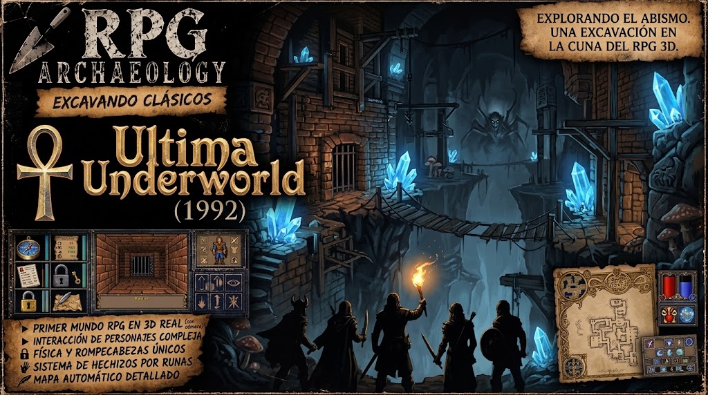

# Ultima Underworld: The Stygian Abyss (1992)

<figure markdown>

</figure>

## The dungeon as place, system, and space of possibilities

**Developer:** Blue Sky Productions  
**Publisher:** Origin Systems  
**Reference platform:** MS-DOS  
**Year:** 1992  
**Object of study:** spatial design, exploration, systems, environmental/social narrative, information, progression, and the cost of the fantasy.

---

## 1. Archaeological question

*Ultima Underworld* is usually remembered for its technology: first-person perspective, continuous movement, textures, elevations, slopes, and an extraordinarily advanced three-dimensional space for 1992.

But reducing it to a graphical revolution leaves out much of what is interesting.

The question of this report is different:

> How did *Ultima Underworld* make a dungeon stop feeling like a succession of tiles, rooms, and encounters and start feeling like a place where the player was living an adventure?

And, for *Lands of Folklore*:

> Which principles can be preserved without reproducing the scale of simulation, the specific solutions, or the frictions of *Underworld*?

---

## 2. Context: before the language existed

!!! success "DOCUMENTED FACT"

    *Ultima Underworld* appeared in March 1992, before *Wolfenstein 3D* and later *Doom* consolidated much of the vocabulary of control and representation that we would come to associate with the first-person game.

    A contemporary *preview* in *Computer Gaming World* highlighted precisely the difference with respect to *dungeon crawlers* such as *Eye of the Beholder*: fluid 360-degree movement instead of discrete displacement, describing the result more as a fantasy combat simulator than as a traditional CRPG. *CGW Museum*

    Allen Greenberg's *review*, published by CGW a few months later, already pointed to the reverse: the mouse supported an enormous number of functions, and moving, holding a heading, controlling speed, and jumping between different elevations required coordination unusual in an RPG. *CGW Museum*

!!! abstract "ARCHAEOLOGICAL READING"

    *Underworld* was inventing part of the idiom while writing the work.

    Some of its frictions are not design principles that should be preserved. They are the historical cost of exploring a territory for which mature conventions did not yet exist.

---

## 3. The fundamental fantasy: "being down there"

The fundamental contribution of *Underworld* does not seem to lie in an isolated mechanic.

It comes from the accumulation:

> movement + elevation + slopes + water + darkness + light + objects + inhabitants + resources + conversations + secrets + spatial continuity.

!!! success "DOCUMENTED FACT"

    Paul Neurath has retrospectively described his interest in using the computer to create worlds in which the player could act with a freedom similar to what he experienced in his tabletop role-playing sessions. His emphasis when speaking about *Underworld* decades later is far more on the concepts of simulation and agency than on the feat of *texture mapping*. *Game Developer*

    Dan Schmidt recalls an even more explicit ambition: the young team intended to build a convincing simulation of the *dungeon* in graphics, physics, AI, combat, and even conversation. He also acknowledges that some of those ambitions, such as conversation, ended up resorting to far more conventional solutions. *The Ultima Codex*

!!! abstract "ARCHAEOLOGICAL READING"

    *Underworld* does not only sell the fantasy of:

    > "I am an RPG character."

    Its distinctive achievement is to approach:

    > "I am an adventurer down here."

    Space stops being merely support for stats and encounters and becomes part of the experience.

---

## 4. Space is gameplay

*Underworld*'s spatial differences are not exclusively ornamental.

Elevations, slopes, water, pits, bridges, darkness, inaccessible areas, jumps, and connections between places change how the *dungeon* is traversed and understood.

The contemporary CGW *review* explicitly highlighted jumping chasms and reaching different elevations as skills needed to get around the game. *CGW Museum*

!!! abstract "ARCHAEOLOGICAL READING"

    The revolution cannot be reduced to:

    > RPG + 3D

    A more useful description would be:

    > RPG + PHYSICALLY LEGIBLE AND TRAVERSABLE SPACE

    The terrain stops being background.

    The terrain communicates and conditions possibilities.

!!! tip "LESSON FOR LoF"

    A grid does not prevent achieving this.

    What matters is not that space is continuous, but that its differences have meaning.

    A *Cell* can express:

    - geometry;
    - region;
    - surface;
    - elevation;
    - state;
    - danger;
    - information;
    - possibility of interaction.

    The goal is not to hide that LoF uses *Cells*.

    It is to get the player to end up seeing a *dungeon* before a grid.

---

## 5. Exploring does not only mean finding loot

One of the main findings of this autopsy was to broaden what we understand by exploration reward.

An exploration can provide:

- INFORMATION
- ROUTE
- PERSON
- RELATIONSHIP
- OBJECT
- MECHANISM
- HISTORY
- STATE
- DECISION
- POSSIBILITY

Therefore:

> Exploration produces *gameplay* when it changes what the player knows, understands, or can attempt.

A new tunnel can be worth more than a sword.

A conversation can change the interpretation of a known place.

A seemingly useless piece can acquire meaning hours later.

A mechanism can transform an already visited area.

!!! tip "LESSON FOR LoF"

    A useful question when designing an area is not only:

    > "What content does this room contain?"

    But also:

    > "What possibility can the player discover here?"

    This does not imply that every room must hide something.

    Transition, rest, and orientation spaces are also necessary.

    The problem appears when the player crosses large amounts of space without ever changing their mental representation of the world.

---

## 6. The dungeon contains a society, not just a population of enemies

*Underworld* includes hostile creatures, but also communities, individuals, exchanges, conflicts, and inhabitants that do not exist solely to be eliminated.

The result is fundamental to the perception of the Abyss as a place.

The story of Sir Cabirus's colony also provides a historical substrate: the player does not simply enter a dungeon built to receive them; they enter the remains of a social project that had a prior history.

!!! abstract "ARCHAEOLOGICAL READING"

    The inhabitants help answer an essential question:

    > "Why does this place exist when I am not here?"

    A room with hostile *goblins* is an encounter.

    An area occupied by groups with relationships, problems, and history starts to feel like territory.

---

## 7. Stories that belong to the world

*Underworld* has an explicit plot: Garamon, Arial, Tyball, and the danger associated with the *Slasher of Veils*.

But around it there is another layer formed by the history of Cabirus, its talismans, current inhabitants, relationships, scattered objects, and local conflicts.

Dan Schmidt explains that, when they began building the eight levels, the macrostructure — talismans, key parts, and plot obligations — was already established. Each designer knew what their level had to contribute, but then had considerable local freedom. Schmidt ultimately took charge of connecting and homogenizing the whole. *The Ultima Codex*

That suggests an especially interesting model:

```text
MACROSTRUCTURE
      ↓
AREA CONTRACT
      ↓
LOCAL DESIGN FREEDOM
```

Not everything local needs to exist exclusively to push the main plot forward.

---

## 8. Local problems, distant consequences

The structure of several talismans shows connections that cross levels and characters.

For example, the *Sword of Justice* requires finding parts in different places and returning to Shak to repair it. The *Ring of Humility* links a Gazer, a reward, and later information provided by Derek. Freeing Murgo ends up providing information related to the *Wine of Compassion*. Community documentation preserves these acquisition chains. *Sir Cabirus*

Not all situations in *Underworld* work this way, and we should not romanticize the game: conventional errand-and-reward structures also exist.

But the pattern appears often enough to be interesting:

```text
PERSON
   ↓
PROBLEM / DISCOVERY
   ↓
OBJECT / INFORMATION
   ↓
ANOTHER PLACE
   ↓
ANOTHER PERSON
   ↓
CONSEQUENCE
```

!!! abstract "ARCHAEOLOGICAL READING"

    A story does not need to be presented initially as a complete *quest*.

    It can emerge from relationships between things the player discovers separately.

!!! tip "LESSON FOR LoF"

    The world provides stories; the player discovers them.

    That does not eliminate authored narrative.

    It changes how part of that narrative reaches the player.

---

## 9. Backtracking as reinterpretation

Returning to a known place is not necessarily repeated content.

It can be progress if the player returns with:

- new information;
- another object;
- a new relationship;
- a change of state;
- knowledge of a rule;
- a new interpretation of space.

The *Sword of Justice* is a simple example: spatially distributed components acquire meaning when the player understands their relationship and remembers someone capable of repairing them. *Sir Cabirus*

!!! abstract "ARCHAEOLOGICAL READING"

    Good *backtracking* roughly follows:

    ```text
    INVESTIGATE
       → DISCOVER
       → LEARN / OBTAIN
       → REINTERPRET
       → RETURN
       → NEW POSSIBILITY
    ```

    Not:

    ```text
    FIND BLUE KEY
       → WALK EIGHT MINUTES
       → OPEN BLUE DOOR
    ```

    Shortcuts and new connections also have an important cognitive function: they progressively compress a space the player already knows.

---

## 10. Knowledge is progression

*Underworld* does not progress exclusively through stats, experience, and equipment.

The player accumulates knowledge about people, relationships, places, properties, objects, mechanisms, and routes.

This leads to a form of progression that RPG Archaeology had already encountered, in another form, in *The Dark Heart of Uukrul*: understanding the rules can also be progressing.

In *Underworld* the pattern can be expressed as:

```text
OBSERVE
   → TEST
   → RESULT
   → LEARN
   → GENERALIZE
```

When this works, the player stops asking only:

> "What does the game want me to do?"

and starts asking:

> "Will what I learned there work here?"

That is where systemic play appears.

---

## 11. A small grammar of interaction

To analyze this type of design, it is useful:

```text
VERB → OBJECT → PROPERTY → STATE → CONSEQUENCE → INFORMATION
```

What matters is not necessarily multiplying verbs.

It is getting the existing ones to act on properties consistent enough that the player can build a mental model.

!!! tip "LESSON FOR LoF"

    LoF does not intend to become a universal simulation, nor does it need to pursue the *immersive sim* label.

    The interesting transfer is:

    build a bounded, coherent, and discoverable set of basic RPG mechanics that can be recombined in numerous situations.

    We do not want the player to think:

    > "I can do anything."

    We want them to learn:

    > "I know what things this world allows, and I just thought of trying one."

---

## 12. Information: the interface remembers, the player deduces

*Underworld*'s automap updates as you explore and lets the player write their own annotations directly. The manual expressly teaches this feature. *Abandonware DOS*

This has an important design consequence.

There is a difference between:

externalizing memory

and

externalizing reasoning.

A modern system can remember:

```text
Shak — blacksmith.
Flooded gallery.
Unknown mechanism.
Symbol seen in the crypt.
```

without automatically transforming those observations into:

```text
QUEST: REFORGE THE SWORD
☑ Find blade
☐ Find hilt
☐ Return to Shak
📍 TRACK
```

!!! tip "LESSON FOR LoF"

    The interface remembers; the player deduces.

    The player should not need to remember what they did two Tuesdays ago after work.

    But we also do not need to resolve for them the relationships between the information we have preserved.

    That allows reducing friction without reducing intellectual responsibility.

---

## 13. Light, food, and corporeality

The manual itself uses the torch very early on to teach the player how the world's visibility changes and later warns of the need to have food. *ManualMachine*

!!! success "DOCUMENTED FACT"

    Food has its own nutrition values and exists as a systemic resource. Reconstructed tables of the game show different values for meats, breads, fish, corn, *popcorn*, mushrooms, and other foods. *Ultima Codex*

    However, it is worth correcting an easy simplification: in *Ultima Underworld*, hunger does not work exactly like a modern survival bar whose fall quickly leads to death. Among its effects is impairing recovery when resting; literally dying of starvation is difficult in a normal playthrough. *Ultima Codex*

!!! failure "NOT DEMONSTRATED"

    We have not found sufficient evidence to affirm that contemporary players specifically considered the hunger system tedious or unpleasant.

!!! abstract "ARCHAEOLOGICAL READING"

    The interest for LoF is not copying hunger.

    It is distinguishing:

    ```text
    RESOURCE → MAINTENANCE
    ```

    from:

    ```text
    RESOURCE → DECISION
    ```

    A resource deserves special attention when it keeps producing decisions after the player understands how it works.

    That is why for LoF it is potentially more interesting:

    ```text
    INGREDIENT → PREPARATION → EFFECT
    ```

    than:

    ```text
    HUNGER -1 → EAT BREAD → HUNGER +10
    ```

    And with light:

    ```text
    SOURCE → PROPERTIES → DURATION / RANGE / INTENSITY → DECISION
    ```

    without needing to decide now on future stealth or perception systems.

---

## 14. Combat: spatial continuity in exchange for friction

*Underworld* keeps combat within the same continuous space as exploration.

There is no transition to a separate board or subsystem.

That preserves physical presence.

But it also forces movement, orientation, action selection, and combat to share a still-experimental interface.

!!! success "CONTEMPORARY EVIDENCE"

    The CGW *preview* described combat favorably as fluid. *CGW Museum*

    A few months later, Allen Greenberg's *review* highlighted the considerable coordination demands and the functional overload of the mouse. *CGW Museum*

!!! abstract "CONCLUSION"

    There is no basis for writing:

    > "Combat in *Underworld* was bad."

    Nor:

    > "Real-time combat was a superior evolution of turn-based RPG."

    The evidence shows different perceptions.

    The correct archaeological question is:

    > What does *Underworld* gain by making combat real-time within the space, and what does it pay for it?

!!! tip "LESSON FOR LoF"

    ```text
    REAL TIME ≠ EVOLUTION
    TURN BASED ≠ PRIMITIVE HERITAGE
    ```

    The combat model should be judged by the experience it produces and the problems it solves.

---

## 15. Cost of the fantasy

*Underworld* wanted the player to believe they were physically inside the Abyss.

That had a price.

### Interface and control

The game needed three-dimensional movement, inventory, conversation, manipulation, magic, combat, look, use, and pick up before consolidated conventions existed for integrating all of it.

Contemporary press already detected this friction. CGW compared some of the required coordination skills to those of driving or flight simulators. *CGW Museum*

### Hardware

Continuous space, textured surfaces, elevations, creatures, objects, and lighting demanded a considerable computational budget for a 1992 PC.

The result also included visible compromises such as a relatively small *viewport* and an interface that occupied a significant fraction of the screen.

### Systemic complexity

Dan Schmidt recalls that they intended to simulate practically every aspect of the *dungeon* and acknowledges that some ambitions, especially conversation, did not find a solution equivalent to the initial aspiration. *The Ultima Codex*

!!! abstract "ARCHAEOLOGICAL READING"

    *Underworld* paid for its fantasy through:

    ```text
    HARDWARE + INTERFACE + LEARNING + SYSTEMIC COMPLEXITY
    ```

    Not all of those costs belong to the essence of what made the game interesting.

!!! tip "LESSON FOR LoF"

    We can preserve:

    cognitive demand

    without preserving:

    operational friction.

    We can preserve:

    exploration

    without preserving:

    uncomfortable controls.

    We can preserve:

    deduction

    without preserving:

    unnecessary memory load.

    We can preserve:

    related systems

    without building:

    a universal simulation.

---

## 16. Reception and commercial success

Here it is especially important to avoid the myth of the "masterpiece nobody bought."

!!! success "DOCUMENTED FACT"

    A snapshot of Origin's internal newsletter dated July 31, 1992, showed approximately 41,000 copies shipped of *Underworld*, versus about 71,000 of *Ultima VII*. *Filfre*

    Sales continued to grow afterward. Jimmy Maher's historical reconstruction attributes that behavior to extraordinarily favorable reviews and strong word of mouth; he also records Paul Neurath's later claim that the game eventually surpassed half a million copies worldwide. That last figure must be kept as a retrospective claim by Neurath, not as independently verified accounting. *Filfre*

    Contemporary critical reception was very strong. *Computer Gaming World* recognized it as RPG of the Year and it later entered its Hall of Fame; it also received the *Origins Award* for best fantasy or science fiction computer game of 1992. *MobyGames*

!!! abstract "CONCLUSION"

    Not:

    > "*Underworld* sold poorly."

    Nor:

    > "It was an instant bestseller."

    The formulation that best fits the available evidence is:

    *Underworld* began with relatively moderate sales compared to *Ultima VII*, but developed a long commercial trajectory supported by exceptional critical reception and word of mouth, also becoming a title of enormous historical prestige.

!!! info "CONTEXT"

    It must be interpreted within the PC and RPG market of the early nineties, incomparably smaller than today's market.

    We do not have sufficient evidence to directly attribute its initial commercial pace to the social stigmatization of video games, although this forms part of the broader cultural context of the era and would increase notably during the following years.

---

## 17. Underworld does not prove that "more simulation = better RPG"

That would be a mistaken reading of the entire excavation.

Its interesting legacy does not consist of:

```text
hunger + physics + NPC + conversation + crafting + first person + real time = good game.
```

Schmidt's own testimony demonstrates that the ambition of simulation could exceed what was actually possible to implement satisfactorily. *The Ultima Codex*

!!! abstract "ARCHAEOLOGICAL READING"

    The power appears when enough elements of the game form a coherent language.

    Therefore:

    ```text
    consistency > quantity of systems
    ```

    But this also should not be transformed into an artificial rule like "LoF can only have ten systems."

    LoF needs the systems proper to its RPG.

    The question is to ensure they do not live in watertight compartments.

---

## 18. What LoF preserves

We do not copy *features*.

We preserve questions and principles.

| Underworld | Transferable principle | LoF |
|---|---|---|
| Continuous 3D space | Space must have meaning | Grid with spatial semantics |
| Light/darkness | The environment can be resource and state | Light sources with properties |
| Inhabitants/factions | The dungeon can have a society | NPCs and bounded relationships |
| Distributed objects | Knowledge connects places | Related stories/objects |
| Annotatable automap | Externalize memory | Map/journal that remembers |
| Free exploration | Discover possibilities | Routes, information, states, interaction |
| Backtracking | Reinterpret known space | New states/knowledge/connections |
| Broad simulation | Rules can be combined | Bounded box of coherent mechanics |
| Bodily resources | Resources can produce decisions | Avoid maintenance without gameplay |
| Freedom | Formulate your own solutions | Freedom within LoF's language |

---

## 19. What we do NOT inherit

There is no obligation to copy:

- periodic hunger;
- *real-time* combat;
- 1992 multimodal interface;
- continuous movement;
- universal physics simulation;
- systemic conversations;
- all manipulable objects;
- all survival systems;
- the exact narrative structure;
- the scale of simulation;
- the *immersive sim* label.

The goal is not to build *Ultima Underworld III*.

Neurath can take care of the brown. 😄

---

## 20. LoF seed: Search / Rummage

This idea does not historically come from *Underworld*. It arises during this autopsy when asking ourselves how to make even LoF's minimum spatial unit occasionally invite curiosity.

!!! tip "DESIGN SEED — NOT AN ADR"

    A *Cell* could optionally admit:

    ```text
    UNSEARCHED → SEARCH → SEARCHED
    ```

    With two possible sources of result:

    ```text
    DEFAULT → contextual profile → RNG low-tier
    ```

    or:

    ```text
    AUTHORED → predetermined result
    ```

    The systemic result can be small: nothing, a few coins, common supplies, an ingredient, common ammunition, cheap curiosity, or a small risk.

    The authored result can use the same verb to exceptionally produce a specific object, information, discovery, or change of state.

    The player does not need to know which of the two mechanisms responded.

!!! note "PRINCIPLE"

    The general system creates an expectation; authorship can take advantage of it.

!!! warning "RISK"

    A per-*Cell* search could easily degenerate into compulsive behavior:

    > "I have to rummage through all 16 *Cells* in this room."

    Therefore, it only merits a prototype.

    The validation question will be:

    > Does searching make the player pay more attention to the *dungeon*, or does it make them want to mark every *Cell* as completed?

---

## 21. Questions Underworld leaves open for LoF

These questions deserve to survive the report:

> Can a rule learned in one place be applied spontaneously in another?

> Does exploration change the player's possibilities, or does it only fill their inventory?

> Does a resource generate decisions or maintenance?

> Does *backtracking* allow reinterpreting a known place?

> Does the interface remember without resolving?

> Do the inhabitants seem to belong to the *dungeon*, or do they wait for the player to deliver content?

> Do the stories seem to exist in the world, or only in the *quest log*?

> Can a *Cell* represent a possibility in addition to geometry?

> How much additional play can we get from the RPG mechanics that already exist before needing a new one?

---

## 22. Archaeological synthesis

!!! abstract "ARCHAEOLOGICAL READING"

    The great lesson of *Ultima Underworld* is not that an RPG needs more simulation. It is that a world becomes convincing when the player learns that its spaces, inhabitants, objects, and rules deserve attention because they can contain possibilities.

    *Underworld* pursued that feeling through an extraordinarily ambitious simulation for 1992.

    LoF can pursue the principle through another strategy:

    a bounded, consistent, and discoverable set of RPG mechanics that produces more situations than systems.

    We do not want the player to think:

    > "I can do anything."

    We want them, after learning the game's language, to look at a situation and think:

    > "Wait... I could try something here."

    If that happens, the *dungeon* is no longer simply geometry connecting encounters.

    It has become a place that deserves to be investigated.

---

## Primary Sources

The most important contemporary basis for this report is the *review* in *Computer Gaming World*, no. 96 (July 1992), especially useful for controls, movement, coordination, elevations, and immediate reception. *Computer Gaming World no. 96 — CGW Museum*

For design intent and production reconstruction, the interview with Dan Schmidt provides direct evidence on the ambition of simulation, conversation, level construction, and plot macrostructure. *Interview with Dan Schmidt — Ultima Codex*

The retrospective interview with Paul Neurath is useful for his design goals and his later reading of *Underworld*, always treating it as testimony thirty years after development. *Paul Neurath on Ultima Underworld — Game Developer*

For the commercial trajectory, *The Digital Antiquarian* reproduces data from Origin's internal newsletter and distinguishes the contemporary figures from Neurath's retrospective claims. *Life Off the Grid: Making Ultima Underworld — The Digital Antiquarian*

The *Player's Guide* constitutes primary evidence for the functioning of light, food, and automap/annotations. *Ultima Underworld Player's Guide — preserved transcription*

For relationships between talismans, characters, and levels we have used community reconstruction; it is evidence of the game's behavior/structure, not contemporary documentation of design intent. *Sir Cabirus — Ultima Underworld Talismans*

---

## Status

**ULTIMA UNDERWORLD: THE STYGIAN ABYSS — AUTOPSY CLOSED** 🔨⚰️
