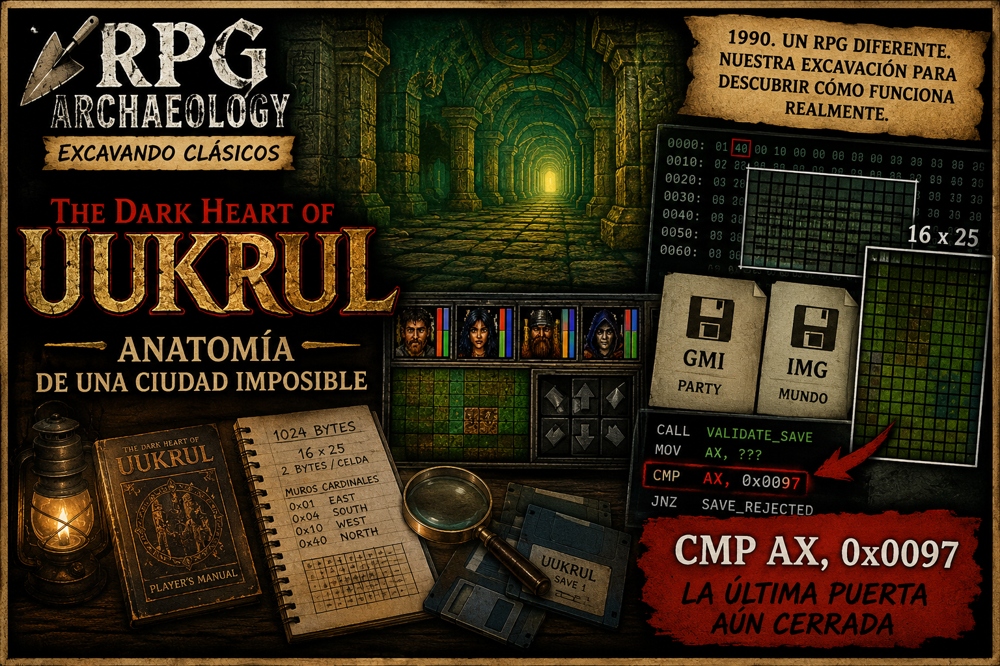

# The Dark Heart of Uukrul — Technical Autopsy Report
## Eriosthé, Map Formats, Transitions, Saves, and Integrity Mechanism

**Project:** RPG Archaeology  
**Provisional Close Date:** 23-08-2026  
**Status:** Research provisionally closed with several confirmed subsystems and a final validation mechanism pending exact resolution.

---

<figure markdown>

</figure>

[▶ Watch the episode on YouTube](YOUTUBE_VIDEO_URL)

## 1. Executive Summary

The investigation began with a relatively modest question: **Can we reconstruct the maps of Eriosthé from The Dark Heart of Uukrul's original data?**

The answer is yes.

From the `MZ*.LEV` files, executable, `UUKRUL.LIB`, `UUKRUL.OVR`, auxiliary tables, controlled saves, and debugging sessions in DOSBox-X, it was reconstructed with high accuracy:

- physical format of levels;
- exact wall topology;
- runtime representation of position and orientation;
- separation between group state (`.GMI`) and world snapshot (`.IMG`);
- part of the teleport/transitions architecture;
- a safe save parsing/editing tool;
- and the existence of a real integrity/anti-tamper mechanism that rejects seemingly valid modifications.

What was not fully achieved:

- complete enumeration of all MZ→MZ transitions;
- full semantics of event bytecode in `.LEV` files;
- nor the final algorithm causing modified saves to be rejected.

The investigation did locate the final stretch of that validator and instrumented the executable to observe the returned value at runtime.

---

## 2. Autopsy Philosophy

The operational rule was to always distinguish between:

- **CONFIRMED** — demonstrated by code, data, or runtime;
- **STRONG** — well-supported inference;
- **SPECULATIVE** — useful hypothesis not yet closed;
- **UNKNOWN** — unresolved;
- **RETRACTED** — previous interpretation corrected by new evidence.

This criterion proved especially important as several early hypotheses were discarded later. The research shouldn't be read as a linear chain of perfect discoveries, but as a succession of hypotheses, tests, corrections, and cuts.

---

# PART I — ERIOSTHÉ

## 3. Format of MZ*.LEV Files

The studied levels use exactly **1024-byte `.LEV` files**.

Reconstructed structure:

| Offset | Size | Meaning | Confidence |
|---|---:|---|---|
| `0x000` | `0x320` | geometry | CONFIRMED |
| `0x320` | `0xE0` | events/script block | STRONG |
| total | `0x400` | complete file | CONFIRMED |

Geometry occupies:

- 25 rows;
- 16 columns;
- 2 bytes per cell.

Access formula:

```text
cell = DS:0x3816 + Y*0x20 + X*2
```

with:

```text
Y = 0..24
X = 0..15
```

The loader copies the complete file into the runtime level buffer.

---

## 4. Bit-Exact Wall Topology

The lower byte of each cell contains the four cardinal walls:

```text
0x01 = EAST
0x04 = SOUTH
0x10 = WEST
0x40 = NORTH
```

Semantics:

```text
bit set = wall / blocked
```

The remaining four bits of the lower byte:

```text
0x02
0x08
0x20
0x80
```

are special flags whose full semantics remain unresolved.

The high byte functions as additional type/feature, also preserved as unknown when sufficient evidence didn't exist.

The cardinal assignment was sustained through independent signals:

- redundancy between opposite sides of neighboring cells;
- statistical symmetry;
- global connectivity;
- correspondence with movement/LOS code.

Runtime uses directions:

```text
dir0 = +X = EAST
dir1 = +Y = SOUTH
dir2 = -X = WEST
dir3 = -Y = NORTH
```

---

## 5. Spatial Philosophy of the Engine

There's no evidence of independent N/S and E/W edge arrays.

Topology is encoded **per cell**.

Movement and LOS query the directional state of a cell via engine helpers. Non-zero result equals blocked direction.

This produces a very compact representation:

```text
2 bytes/cell
→ connectivity
→ type/feature
→ special flags
```

An interesting design conclusion: maps are small in absolute dimensions, but each cell can contain substantial playable information.

---

## 6. Event Block of LEV Files

The last 224 bytes show structured behavior and don't appear to be padding.

Tokens observed recurring:

```text
01 00
3E 00
81 B8 66
```

The strongest interpretation:

```text
0x320..0x3FF = compact event/command stream per level
```

The exact semantics of all opcodes remained open.

---

## 7. MZREG2

`MZREG2.LEV` appears in program tables/names but the file wasn't found in the game data used during research.

This points to a pre-planned and unshipped slot or withdrawn/incomplete content.

Automatic inference of what that level would have contained shouldn't be made.

---

# PART II — TRANSITIONS AND TELEPORTS

## 8. TPORTS.TBL

`TPORTS.TBL` showed recognizable internal structure.

Four-byte records were identified with high regularity, and zone groups were found with labels like:

```text
A B C D
X Y Z
1 2 3 4 5
! * ?
```

Records form topological relationships between zones and coordinates, but complete binding:

```text
source MZ → port → destination MZ/X/Y
```

was not closed statically.

---

## 9. Confirmed Teleport Chain

The general mechanics could be reconstructed though:

```text
event / port
→ selection via [0x3C1E]
→ 12-character row
→ destination decoding
→ dstX
→ dstY
→ dstLevel
→ SetLevel
→ load of new MZ
```

A `SetLevel` callable at runtime was also located via a far call, which established a reliable breakpoint during testing.

The final obstacle was locating the exact corpus of 12-character teleport rows generated/queried via resident/overlay helpers.

---

## 10. World Graph Result

Transition architecture was demonstrated.

The complete enumeration of direct MZ→MZ edges remained **PARTIAL**.

Therefore, any final graph must distinguish:

- confirmed nodes;
- zone relationships;
- directly demonstrated edges;
- still-inferred edges.

---

# PART III — SAVE ARCHITECTURE

## 11. Two Files, Two Responsibilities

Research with controlled saves showed a clear separation.

### GMI

Contains primarily structured group state.

Findings:

```text
party base = 0x80
stride = 0x60
4 records
```

Fields identified:

```text
status
current_hp
max_hp
name
inventory_count
inventory_raw
```

The parser built preserves unknown bytes.

### IMG

Contains runtime/world snapshot state.

Mapping confirmed during experiments:

```text
IMG +0x0A → Y
IMG +0x0C → X
IMG +0x0E → LEVEL
IMG +0x14 → FACING
```

Demonstrated with controlled saves:

- A = base state;
- B = turn;
- C = movement.

The `.GMI` files remained byte-identical while `.IMG` reflected movement/orientation.

---

## 12. CONTROL_A / B / C

Controlled experiments were decisive.

### Turn

`CONTROL_A_BASE → CONTROL_B_TURN`

Changes observed in IMG:

```text
0x14   FACING
0x24E  irregular state
```

### Movement

`CONTROL_A_BASE → CONTROL_C_MOVE`

Changes observed:

```text
0x0A   Y
0x14   FACING
0x24E  irregular state
0x655  map/step state still unresolved
```

The word at `0x24E` changes with legitimate actions and ceased being considered a simple checksum.

Final prudent interpretation:

```text
0x24E = RNG/action/runtime state
```

Not demonstrated as the integrity mechanism.

---

# PART IV — SAVE ARCHAEOLOGY TOOL

## 13. Phase I — Core Headless

A safe parsing/editing tool was built.

Capabilities:

### GMI

Editable:

```text
name
status
current_hp
max_hp
```

### IMG

Readable:

```text
level
x
y
facing
```

Unknown bytes preserved.

No-op roundtrip:

```text
GMI: byte-identical
IMG: byte-identical
```

Tool uses copy-on-write and avoids overwriting original.

---

## 14. Phase II — World Editing

Experimental support added for:

```text
LEVEL
X
Y
FACING
```

Tests verified that isolated changes only modified expected bytes while keeping the rest of the file intact.

A lab was generated with:

```text
FACING 0 → 1
```

Tests passed.

At binary level, the save seemed perfectly coherent.

At runtime, Uukrul rejected it.

---

# PART V — THE ANTI-TAMPER DISCOVERY

## 15. Runtime Experiment

Two independent manipulations were tested.

### A — GMI

Change:

```text
HP 42 → 40
```

A perfectly playable state.

Result:

```text
save rejected
```

### B — IMG

Change:

```text
FACING 0 → 1
```

Also a perfectly valid state.

Result:

```text
save rejected
```

The game showed a message equivalent to:

> The game saved on this disk is faulty. Use another saved game or another disk.

The exact runtime phrase related to *tampering* didn't appear as a complete literal in the binaries investigated; the locally found EXE message variant was "faulty".

Strong conclusion:

```text
Uukrul validates something beyond the plausibility of edited fields.
```

There's an additional consistency/integrity invariant.

---

## 16. What Was NOT Demonstrated

It was not proven that the mechanism is:

- DRM;
- deliberate anti-cheat;
- a conventional checksum;
- a simple sum/XOR;
- or exclusively disk corruption protection.

The recommended terminology is:

```text
save-integrity / anti-tamper mechanism
```

The interpretation of deliberate anti-cheat is plausible but requires more evidence on intent and algorithm.

---

# PART VI — LOADER VALIDATION

## 17. Load Route Located

Static research located the load function and a validation segment.

The relevant pattern reduced to:

```text
save loader
→ validation/dispatch
→ dynamic handler
→ return in AX
→ CMP AX, 0x0097
→ subsequent branch
```

A particularly relevant piece:

```text
ljmp cs:[0x05DE]
```

The destination of `cs:[0x05DE]` is configured at runtime via a pointer chain linked to low memory.

This explains much of the difficulty of purely static analysis.

---

## 18. Important Correction: XOR AH,AH

Many times during research the pattern appeared:

```text
30 E4
```

Initially interpreted erroneously as a XOR operation between bytes related to checksum.

The interpretation was corrected:

```text
XOR AH,AH
```

That is, clearing `AH` / zero-extension.

This checksum hypothesis was **RETRACTED**.

A good example of why intermediate conclusions must retain their epistemic status.

---

## 19. CMP AX,0x0097

The loader contains a comparison:

```text
CMP AX,0x0097
```

What was not definitively demonstrated:

- what `AX` represents;
- what `0x97` represents;
- what value exactly a good save produces;
- what value a modified save produces;
- and the first causal divergence.

Therefore:

```text
0x97 should NOT be called checksum.
```

It's only a relevant constant within the observed gate.

---

# PART VII — RUNTIME TRACING ATTEMPT

## 20. DOSBox-X

DOSBox-X was configured with debugger and logging.

The practical problem was that the agent couldn't reliably control the interactive debugger window via SendKeys/PowerShell.

This led to an instrumental escalation.

---

## 21. EXE Instrumentation

The last proposed agent —and applied— experimental instrumentation of the executable.

Idea:

```text
intercept just before CMP AX,0x97
→ capture AX
→ emit AL/AH via I/O ports
→ continue original flow
```

Backups of the original executable were preserved before modification.

Relative jumps were calculated so instrumentation wouldn't depend on the process load segment.

The experiment didn't produce a documented final capture of:

```text
AX_good
AX_corrupted
```

before closing the investigation.

Thus this branch should be treated as:

```text
INSTRUMENTATION IMPLEMENTED / FINAL MEASUREMENT PENDING
```

and not as a resolved integrity algorithm.

---

# PART VIII — AUTOPSY STATUS

## 22. Confirmed

### World

- `.LEV` files of 1024 bytes.
- 16×25 grid.
- 2 bytes/cell.
- bit-exact cardinal walls:
  - E `0x01`
  - S `0x04`
  - W `0x10`
  - N `0x40`
- set = blocked.
- runtime buffer and coordinates identified.
- events in separate tail.

### Saves

- `.GMI` and `.IMG` have distinct responsibilities.
- party records in GMI.
- spatial state in IMG.
- X/Y/LEVEL/FACING offsets identified.
- safe parser and byte-perfect round-trip.
- functional binary editing.

### Integrity

- minimal modifications that are semantically valid are rejected by original game.
- additional validation/consistency mechanism exists.
- loader path reduced to dynamic handler and `CMP AX,0x97`.
- `0x24E` insufficient to explain rejection.
- sum/XOR simple checksum searches didn't resolve mechanism.

---

## 23. Open

- full meaning of cell special flags.
- complete LEV event bytecode.
- final MZ→MZ transition table.
- full semantics of dynamic validation handler.
- meaning of AX and `0x97`.
- exact integrity algorithm.
- generation of a modified save accepted by original executable.

---

# PART IX — ARCHAEOLOGICAL CONCLUSION

## 24. About Uukrul

The picture obtained is that of an RPG extremely compact but highly structured.

Its maps don't need large dimensions to produce density:

```text
cell
→ geometry
→ orientation
→ feature
→ events
→ exploration state
```

The game uses a small and economical spatial representation, accompanied by auxiliary systems that turn those few cells into meaningful content.

The save architecture is also more sophisticated than it appears:

```text
GMI = party / structured state
IMG = runtime snapshot / world
```

and external modifications aren't accepted simply for maintaining plausible values.

---

## 25. About the Integrity Mechanism

The prudent conclusion is:

> The Dark Heart of Uukrul contains a real save-validation mechanism capable of detecting manual modifications of perfectly legitimate fields.

It hasn't been demonstrated whether its primary motivation was:

- disk corruption;
- anti-cheat;
- or both.

The error message and observed behavior make this historical question especially interesting.

---

# PART X — WHAT WE LEARNED FROM THE PROCESS

## 26. Research with Agents

The autopsy ended up being an experiment in agent work as well.

Two very distinct task classes were observed:

### Bounded Implementation

When the objective was:

```text
implement parser
add tests
preserve bytes
```

agents worked efficiently.

### Open Research

When the objective was:

```text
figure out what this means
```

the following appeared:

- massive context growth;
- simultaneous hypotheses;
- need to retract conclusions;
- repeated compressions;
- degradation of global state;
- and finally context exhaustion.

---

## 27. Useful Research Loop

The most effective practice was externalizing state.

Recommended format:

```text
OBJECTIVE

CONFIRMED
STRONG
SPECULATIVE
REJECTED / RETRACTED
BLOCKED

ARTIFACTS

NEXT QUESTION
```

Each cut should reduce one concrete uncertainty.

When static analysis stops producing information, the method must change:

```text
static → runtime
analysis → controlled experiment
agent automation → human-in-the-loop
```

---

## 28. Human-in-the-loop

An especially clear learning:

It's not worth spending tens of minutes trying to automate an interaction a human can perform in five seconds.

For future research:

```text
HUMAN_ACTION_REQUIRED
```

Should be a legitimate operational state.

Example:

```text
Agent:
"Breakpoint ready. Metal: press P and confirm."

Human:
"Done."

Agent:
"Capture logs and continue."
```

---

## 29. Model Division

Research suggests a practical separation:

### Strong Model

Useful for:

- reducing uncertainty;
- comparing hypotheses;
- deciding the next experiment;
- maintaining conceptual architecture.

### Fast/Local/Scrappy Model

Useful for:

- searches;
- scripts;
- diffs;
- xrefs;
- disassembly;
- tests;
- concrete experiments.

The expensive resource doesn't have to be the entire execution: it can be the **intellectual direction of the next cut**.

---

# PART XI — CLOSURE

## 30. Status

```text
ERIOSTHÉ MAP FORMAT        CONFIRMED
CARDINAL WALL TOPOLOGY     CONFIRMED
SAVE SPLIT GMI/IMG         CONFIRMED
SAVE TOOL CORE             COMPLETE
WORLD EDIT BINARY          IMPLEMENTED
WORLD EDIT ORIGINAL GAME   REJECTED BY INTEGRITY
SAVE INTEGRITY EXISTENCE   CONFIRMED
INTEGRITY ALGORITHM        UNRESOLVED
FULL WORLD GRAPH           PARTIAL
```

---

## 31. Optional Future Cut

If returning:

**Save Integrity Final Cut**

Single objective:

```text
capture AX_good and AX_corrupted
at gate CMP AX,0x0097
```

Then:

```text
trace back only to first demonstrable divergence
```

Don't reopen the entire investigation.

---

## 32. Final Conclusion

The autopsy doesn't need to be declared incomplete simply for not defeating the last gate.

It answered with solid evidence several more important questions than the original save editor stunt:

- how Uukrul represents its maps;
- how walls and features are stored;
- how world and party are preserved;
- how position is restored;
- and that the game has an additional integrity invariant detecting external modifications.

The last door remains closed:

```text
what exactly does the validator compute before CMP AX,0x0097?
```

And it's perfectly localized for a future excavation.

---

## Session Sources Used

- `SES2.md` — long prior session: maps, teleports, save archaeology tool, Phase I/II.
- `laguna_round2_fight.md` — static research of save-integrity gate and dynamic dispatch.
- `Pegado text.txt` — latest runtime/instrumentation state and experimental patch.

Previous conclusions corrected during sessions have been treated as retracted, not as final facts.