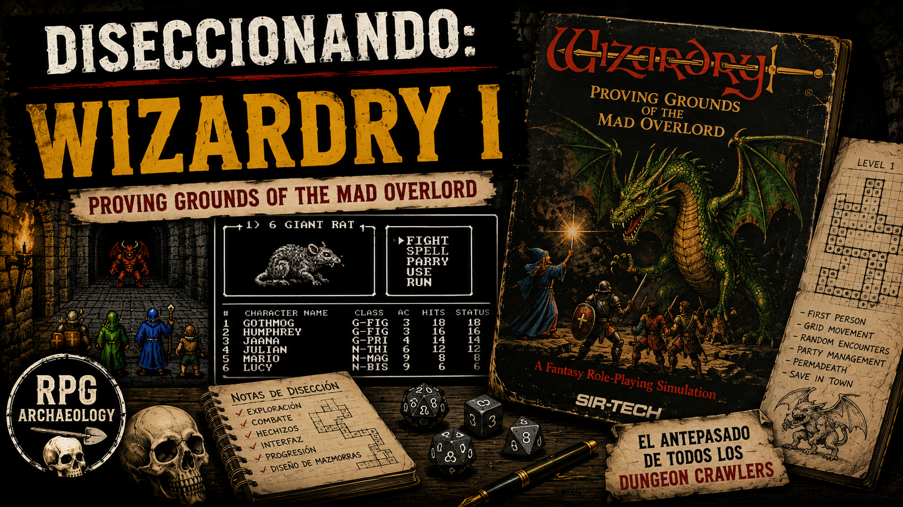

# Wizardry: Proving Grounds of the Mad Overlord — Autopsy of a Dungeon

<figure markdown>

</figure>

[▶ Watch the episode on YouTube](https://youtu.be/8hvuzZrDd20)

## 1. The Specimen

*Wizardry: Proving Grounds of the Mad Overlord* appears in the early 1980s as one of the first serious attempts to bring a party-based RPG experience—exploration, combat, progression, and persistence—to the domestic microcomputer.

Its presentation is extremely austere from a modern perspective: text, menus, and a small first-person linear representation of the dungeon.

However, that austerity proves misleading.

Research into the game through contemporary documentation, later analysis, and especially the reconstruction of the actual Pascal/assembler code performed by Thomas William Ewers reveals a system considerably more complex than its interface communicates. Later analyses also warn that the reconstruction does not constitute the original source code and that some variable and function names were assigned during reverse engineering.

This will therefore be a fundamental distinction:

Ewers' reconstruction allows observing the behavior of the original program, but must not be confused with the sources originally written by Greenberg and Woodhead.

Our first provisional conclusion will also serve as the thread throughout this dissection:

The austerity of *Wizardry* lies fundamentally in its representation. The game model behind it is much richer.

## 2. The Dungeon as Data Structure

The world of *Wizardry* does not need to store three-dimensional geometry.

Each level constitutes a logical space of 20 × 20 positions.

The reconstructed TMAZE record contains four cardinal arrays:

```text
W[20][20]
S[20][20]
E[20][20]
N[20][20]
```

Each entry uses a TWALL with four possible states:

- OPEN
- WALL
- DOOR
- HIDEDOOR

Four possibilities require only 2 bits.

Therefore, for a coordinate (x,y):

```text
N = 2 bits
E = 2 bits
S = 2 bits
W = 2 bits
---------
    8 bits
```

The four cardinal arrays of a level thus require approximately:

```text
20 × 20 × 4 × 2 bits
= 3200 bits
= 400 bytes
```

The first architectural lesson appears immediately:

*Wizardry* does not store what it draws. It stores the minimum information necessary to reconstruct it.

### 2.1. An Important Correction: Edges Are Duplicated

An initial interpretation might lead us to think that the boundary between two cells is stored only once.

It does not appear to be so.

There are four complete cardinal arrays. Therefore:

A.E

and:

B.W

are independently stored values.

Conceptually *Wizardry* uses:

```text
Cell[x,y]
├── North
├── East
├── South
└── West
```

and not:

```text
Cell A ─── SharedEdge ─── Cell B
```

This introduces redundancy, but offers an enormous advantage: trivial spatial queries.

If the party faces north, query N[x][y]; if they face east, E[x][y].

There's no need to resolve ownership, locate a shared structure, or normalize the boundary.

We have no evidence that speed was the explicit reason for this choice, so it must remain as a hypothesis. But architecturally we find an interesting trade-off:

small data redundancy in exchange for extreme simplicity in runtime queries.

## 3. A Cell Is More Than Geometry

TMAZE does not contain only walls.

We also find structures equivalent to:

```text
FIGHTS[20][20]
SQREXTRA[20][20]
SQRETYPE[]
AUX0[]
AUX1[]
AUX2[]
ENMYCALC[]
```

That is, space combines several layers:

```text
         CELL
          │
     ┌─────┼─────┐
     ▼     ▼     ▼
topology event encounter
```

Special types include behaviors like:

- STAIRS
- PIT
- CHUTE
- SPINNER
- DARK
- TRANSFER
- OUCHY
- BUTTONZ
- ROCKWATE
- FIZZLE
- SCNMSG
- ENCOUNTER

Therefore, the dungeon is not merely a floor plan.

It is an executable logical space.

A coordinate can trigger a transition, change orientation, cause damage, remove lighting, show information, or initiate an encounter.

This partially replaces what in tabletop RPGs the referee resolved:

Tabletop RPG

```text
position
   ↓
referee interprets situation
   ↓
consequence
```

*Wizardry* needs:

```text
position
   ↓
cell type
   ↓
predefined rule
   ↓
consequence
```

The computer forces space to be formalized.

## 4. The Spatial State of the Party

*Wizardry* does not need to spatially represent six characters either.

The party is a single navigational entity.

Its fundamental state can be reduced to:

```text
level
x
y
facing
```

Moving forward modifies one coordinate ±1 depending on orientation.

And then something wonderful happens:

```text
(x + 20) MOD 20
(y + 20) MOD 20
```

The dungeon is topologically toroidal.

Exiting through one end can introduce the group through the opposite side.

No special teleportation system is needed to achieve this. It is a mathematical property of the coordinate system.

This produces another lesson:

An inexpensive representation property can become a playable world property.

## 5. The Renderer: There Is No 3D World

The view in *Wizardry* appears three-dimensional.

But the program does not need to construct a general 3D space.

The reconstructed DRAWMAZE routine works from:

```text
MAZEX
MAZEY
DIRECTIO
```

and obtains relative information:

- LEFT
- FRONT
- RIGHT

Then it virtually advances down the corridor.

For each depth:

- query left edge
- query right edge
- query front edge
- draw lines
- reduce perspective box
- advance logical position

Perspective is obtained by progressively reducing dimensions.

We do not have:

```text
vertices
polygons
camera
projection matrix
raycasting
```

We essentially have:

```text
GRID STATE
    ↓
CARDINAL QUERIES
    ↓
PREDEFINED LINE GEOMETRY
    ↓
SCREEN
```

The image does not represent an independent geometric world.

It is a visualization of the logical grid state.

## 6. Light Modifies the Renderer

Lighting provides another excellent example of integration between mechanics and representation.

The variable determining visible distance directly modifies how many positions forward DRAWMAZE inspects.

Conceptually:

```text
SPELL
  ↓
LIGHT
  ↓
VIEW DISTANCE
  ↓
NUMBER OF CELLS INSPECTED
```

No 3D lighting system is needed.

A magic mechanic simply modifies the query depth of the renderer.

The result for the player remains perfectly readable: they can now see further.

## 7. Real State vs. Perception

This is likely one of *Wizardry's* most important spatial principles.

The computer always knows:

```text
position
orientation
topology
boundary type
special square
```

The player does not.

We can distinguish:

```text
WORLD STATE
     │
     ▼
PERCEPTION RULES
     │
     ▼
PLAYER INFORMATION
     │
     ▼
PLAYER'S MENTAL MAP
```

And *Wizardry* deliberately attacks the links between these layers.

**Hidden Door**

The map can know that a boundary is HIDEDOOR while the representation shows seemingly a wall.

**Darkness**

Reduces available information.

**Teleporter**

Changes spatial state without necessarily providing the player enough information to immediately reconstruct what happened.

**Spinner**

Perhaps the perfect example.

Conceptually its essential effect is almost ridiculous:

```text
facing = random(4)
```

The position may remain exactly the same.

But the player's mental map may be destroyed.

**DUMAPIC**

Does precisely the opposite: reveals to the player spatial information the program knows internally.

*Wizardry's* navigation thus becomes a game about spatial information, not just movement.

## 8. The Economy of a Mechanic

Here appears an idea especially exploitable for modern design.

We can analyze mechanics not only by what they produce, but by what they cost.

### Spinner

Objective:
- disorient

State:
- special square

Operation:
- `facing = random(4)`

Result:
- potential destruction of mental map

Technical cost minimal.

Large gameplay consequence.

### Hidden Door

State:
- `TWALL = HIDEDOOR`

Cost:
- 2 bits within existing representation

Runtime:
- additional perception rule

Result:
- exploration + secrets

### Poison

Poison has a 25% chance of triggering during each combat round or each step through the maze.

This turns movement into a simulation tick:

```text
MOVE
 ↓
simulation tick
 ↓
poison check
```

A tiny mechanic connects navigation, resource management, and urgency.

This will be one of *Wizardry's* great lessons:

The depth of a mechanic does not have a direct relationship with its technical cost.

## 9. The Party as Project

Character creation already introduces planning.

Race determines initial attributes and also intervenes in hidden systems like saving throws.

Classes have different requirements, and advanced classes demand much more restrictive combinations. Experience curves also diverge considerably.

But the truly interesting element appears with class change.

The character cannot be described solely by:

```text
class
level
```

Its past matters.

It can retain:

HP from previous development;
learned spells;
magic capacity derived from those spells;
information related to previous levels.

The character thus has mechanical history.

## 10. MaxLev: The Past Exists in Data

MaxLev is especially revealing.

The system remembers a relevant maximum level even when the character changes class or later suffers level drain.

This allows situations like:

```text
FIGHTER LEVEL 10
       │
       │ class change
       ▼
MAGE LEVEL 1
```

But:

```text
MaxLev = 10
inherited HP
previous spells/capabilities
```

Current state does not fully describe the character.

This is a primitive but powerful form of historical build persistence.

## 11. HP: Progression Through Reroll

HP increase is not a trivial sum either.

*Wizardry* recalculates a result based on class dice, level, and Vitality. If the new result exceeds existing HP, it uses it; otherwise the character gets only a minimal improvement.

This produces an interesting statistical consequence:

Bad rerolls do not destroy previous progress.

With successive opportunities, HP can tend towards favorable results within its distribution.

And this interacts with class changes because a character can temporarily retain HP far superior to what its new class/level would normally produce.

## 12. Attributes Are Not Linear Scales

Strength perfectly shows that a statistic of 3–18 does not necessarily mean a continuous function.

Recovered data shows:

```text
STR 3  → -15% hit / -3 damage
STR 4  → -10% / -2
STR 5  → -5% / -1

STR 6–15 → neutral zone

STR 16 → +5% / +1
STR 17 → +10% / +2
STR 18 → +15% / +3
```

Therefore:

```text
STR 7
STR 11
STR 15
```

can be functionally equivalent for certain combat calculations.

The number shown to the player does not directly describe the underlying mathematical function.

## 13. The Visible Character and the Real Character

*Wizardry* possesses derived statistics that are almost never shown.

A fundamental example is the five saving throws:

- Death
- Petrify
- Wand
- Breath
- Spell

Class, race, Luck, and level intervene in these. However, they do not appear as five clearly exposed values on the character sheet. Code analysis even concludes that Save vs. Wand apparently has no effective application in *Wizardry* I.

This produces two models:

```text
VISIBLE CHARACTER
STR IQ PIE VIT AGI LUC
Class / Level / HP / AC
        │
        ▼
HIDDEN CHARACTER MODEL
saving throws
HitCalcMod
SwingCount
HitDam
CritHit
MaxLev
HealPts
...
```

The player controls a more complex system than the UI represents.

## 14. Combat as Pipeline

A physical attack does not simply equate to rolling a die.

Conceptually we find something like:

```text
CLASS + LEVEL
       │
STRENGTH
       │
WEAPON
       ▼
HitCalcMod
       │
       ▼
chance to hit
       │
       ▼
SwingCount
       │
       ▼
N independent strikes
       │
       ▼
HitDam
       │
       ▼
damage
       │
       ▼
critical / resistance / status
```

SwingCount allows Fighters, Samurai, Lords, and especially Ninjas to obtain multiple strikes; each strike checks its own hit possibility independently. Weapons can also provide their own SwingCount, using the higher value instead of accumulating both.

The hit probability is also limited to avoid absolute probabilities.

This preserves uncertainty even against large statistical differences.

### 14.1. SwingCount: Progression and Equipment Do Not Stack

SwingCount determines how many independent strikes a character can attempt during a physical attack.

The progression of certain classes increases its SwingCount.

Weapons can also provide their own SwingCount.

The important finding is that both sources do NOT add.

Conceptually:

```text
CLASS / LEVEL ----\
                  MAX ---> EFFECTIVE SWINGCOUNT
WEAPON -----------/
```

Conceptual example:

```text
Character = 3
Weapon = 4

max(3, 4) = 4
```

NO:

```text
3 + 4 = 7
```

As a consequence, this rule limits stacking:

- character progression and equipment can modify the same capability;
- sources compete rather than accumulate;
- a weapon can provide an enormous improvement while exceeding the character's natural capacity;
- as natural capacity increases, the relative benefit of the weapon's SwingCount may decrease;
- avoids cumulative growth of this variable.

### 14.2. The Unarmed Ninja: The Character as Weapon

The classic Ninja exemplifies how *Wizardry* creates class identity by modifying existing fundamental rules, without introducing a completely separate subsystem of "martial arts."

**A) Natural Defense.**

The unarmed Ninja's AC follows:

AC = 8 - floor(Level / 3)

| Level | AC |
| --- | --- |
| 1 | 8 |
| 15 | 3 |
| 30 | -2 |

A lower AC is better.

**B) Unarmed Damage.**

Ninja: 1d4 + 1d4

Other unarmed classes: 1d2 + 1d2

Applicable modifiers, such as Strength, continue to participate in the normal pipeline.

**C) Natural SwingCount.**

The progression found is:

Ninja: 2 + floor(Level / 5)

Using Level 15 as example:

2 + floor(15/5) = 5 swings

The Ninja reuses the existing physical pipeline but modifies its parameters and rules.

### 14.3. CritHit: A Single Opportunity After Swings

Contrary to what could be inferred from a system of "one critical roll per swing," the reconstructed behavior is:

1. Swings are resolved.
2. Each swing performs its own hit check.
3. Damage caused is accumulated in HPDAMAGE.
4. Only if HPDAMAGE > 0 can CritHit be checked.
5. ONE single CritHit check is performed for the entire attack.
6. If it succeeds, the second check (MonsterLevel) is performed.

```text
N SWINGS
   ↓
independent hit checks
   ↓
accumulate HPDAMAGE
   ↓
HPDAMAGE > 0 ?
   ↓
one CritHit check
   ↓
MonsterLevel check
   ↓
instant kill
```

The probability of triggering CritHit for the Ninja scales approximately as:

min(2 × NinjaLevel, 50) %

Example:

Ninja Level 15 → 30%

It's important not to describe this as final probability of decapitation: there's still the second monster check.

More swings does NOT mean more critical rolls.

More swings increases the probability that at least one produces HPDAMAGE > 0, allowing to reach the unique CritHit check.

### 14.4. MonsterLevel as Resistance to Critical

After passing the CritHit check, a second check is performed:

(RANDOM MOD 35) > (MonsterLevel + 10)

RANDOM MOD 35 produces values 0..34.

This generates progressive resistance based solely on MonsterLevel:

| MonsterLevel | Favorable Results | Probability of passing second check |
| ---: | ---: | ---: |
| 1 | 12–34 | 65.71% |
| 10 | 21–34 | 40.00% |
| 20 | 31–34 | 11.43% |
| 23 | 34 | 2.86% |
| 24+ | none | 0% |

The threshold arises from the formula:

MonsterLevel 23: 23 + 10 = 33. Only RANDOM = 34 passes 33.

MonsterLevel 24: 24 + 10 = 34. Would need a value >34. But RANDOM MOD 35 never exceeds 34.

Therefore:

MonsterLevel ≥ 24 → mathematical immunity to critical, without needing an explicit CRITICAL_IMMUNE flag.

### 14.5. Formula vs. Bestiary

**MAELIFIC**

MonsterLevel = 25

Consequence: mathematically immune to Ninja CritHit.

**VAMPIRE LORD**

MonsterLevel = 20

Not immune. Only 4 results of 35 pass the second check: 31, 32, 33, 34.

P(second check) = 4/35 ≈ 11.43%

**WERDNA**

MonsterLevel = 10

Does not possess mathematical immunity derived from this formula.

P(second check) = 14/35 = 40%

For a Ninja Level 15, conditioned on HPDAMAGE > 0:

0.30 × 0.40 = 0.12

approximately 12% probability of final critical after reaching this pipeline point.

Being the final antagonist does NOT introduce immunity through this mechanic.

**POISON GIANT**

Its peculiar definition, 1d8 + 50, means certain systems that query its logical level may treat it as MonsterLevel 1 despite its high HP reserve.

This illustrates: a shared variable can produce systemic coherence, but an anomaly in that variable can propagate to all systems depending on it.

Many HP ≠ high MonsterLevel.

## 15. States Connect Systems

Sleep/Hold are not merely labels.

A sleeping or paralyzed character or monster receives double damage. Certain weapons also deal double damage against specific enemy categories.

**Poison** connects combat and navigation.

Paralysis and Stone connect combat, traps, magic, and recovery.

Death can lead to Ashes.

Ashes can lead to Lost.

The system thus produces chains:

```text
OK
 ↓
POISON / SLEEP / PARALYSIS / STONE
 ↓
DEAD
 ↓
ASHES
 ↓
LOST
```

Not all are necessarily mandatory sequences, but constitute a hierarchy of deterioration with different recovery tools.

## 16. Death Is Not Just a Game Over

This is one of the most important design points.

The character exists persistently outside the expedition.

Individual defeat does not necessarily mean:

```text
DEAD → reload
```

It can mean:

```text
DEAD
 ↓
recover body
 ↓
temple / spell
 ↓
resurrection attempt
 ↓
success / ashes / lost
```

DI and KADORTO use Vitality to determine resurrection probability and can produce permanent Vitality loss; certain situations can end up making the character Lost.

Death thus becomes a state of the character, not necessarily a final game state.

## 17. The Expedition as Strategic Unit

This completely transforms the game's structure.

*Wizardry* is not just about advancing toward Werdna.

Its fundamental cycle is:

```text
         CASTLE
           │
           ▼
    PREPARE PARTY
           │
           ▼
        DUNGEON
           │
    ┌──────┼───────┐
    ▼      ▼       ▼
  combat  loot   attrition
    │      │       │
    └──────┼───────┘
           ▼
    CONTINUE?
       /       \
     YES        NO
      │          │
    deeper       return
      │          │
      └──────────┘
           ↓
         CASTLE
```

The important decision is not just how to win a combat, but:

How much additional risk can I take before returning?

The preserved game recommendations show precisely very short expeditions during early levels and later progress and farming routes.

Here we have one of the clear ancestors of the expedition loop.

## 18. The Dungeon as Difficulty Curve

Traps show an especially elegant integration between space and progression.

Their disarming incorporates:

```text
Character Level
-
Maze Level
```

with enormous advantages for Thief/Ninja over other classes.

Therefore, dungeon depth is not merely geographic:

```text
DEEPER
  ↓
higher Maze Level
  ↓
harder systemic checks
```

The vertical coordinate of the world becomes a difficulty parameter.

This avoids having to individually configure each check.

## 19. The Party Distributes Competencies

*Wizardry* does not require every character to be able to solve everything.

- Thief/Ninja dominate traps.
- Mage/Priest have distinct magical families.
- Bishop combines progressions but with compromises.
- Fighter/Samurai/Lord/Ninja possess different attack curves and capabilities.
- Priest, Bishop, and Lord can Dispel undead with different penalties and access levels.

The real unit of design is not necessarily the character.

It is the party.

This allows creating specialized characters without demanding individual self-sufficiency.

## 20. Horizontal Progression Within the Vertical

*Wizardry* has levels, but progression is not exclusively:

```text
Level ↑
numbers ↑
```

It also incorporates:

- new spells
- new spell circles
- more strikes
- class eligibility
- class changes
- equipment
- special abilities
- resistances

Spell points depend on class, level, and circle, and spells already known can guarantee availability even after class changes.

The character thus accumulates options, not just magnitudes.

## 21. Aging Introduces Temporal Cost

Age is stored with weekly granularity.

Changing class ages the character by several years, and age affects attribute development. Recovered calculations also show that young characters have better chances of favorable development.

This introduces a non-monetary cost:

```text
CLASS CHANGE
    ↓
new capabilities
    +
age increase
    ↓
future development affected
```

This is a way to prevent class reconversion from being a completely free decision.

## 22. Encounters Scale Structurally

Difficulty does not need to depend solely on increasing HP and damage.

The system can modify:

- number of groups;
- number of enemies;
- available types;
- dungeon level;
- resistances;
- composition.

This allows difficulty to grow through combinatorics, not just numerical inflation.

Another lesson still perfectly exploitable:

Adding relationships between threats can scale difficulty more efficiently than multiplying statistics.

## 23. Bugs as Fossils

The reconstruction contains programmed behaviors that apparently are not used correctly.

HAMAN/MAHAMAN have additional effects that seem inaccessible due to an incorrect CASE expression. Among them appear extreme AC protection and party resurrection.

We also find:

AFRAID, apparently without clear producers in *Wizardry* I;
Save vs. Wand, apparently without effective function;
poison capable of representing values that *Wizardry* I content does not seem to produce;
special object powers programmed but not used.

This allows us to distinguish:

```text
ENGINE CAPABILITY
       ≠
CONTENT ACTUALLY USED
```

We must not automatically infer why that code exists.

It could be:

discarded functionality;
anticipatory infrastructure;
development remnants;
shared support;
bugs.

But it constitutes evidence of internal software evolution.

## 24. When Implementation Becomes Mechanics

LostXYL is probably our favorite fossil.

The structure has multiple uses, and during an expedition one of its fields ends up related to poison.

The documented observable effect is:

dissolving the party removes poison.

This likely does not represent a narrative decision of the type:

"returning to the castle magically cures poison."

It is a consequence of how state is reused.

We have:

```text
MEMORY / DATA REPRESENTATION
           ↓
     reused variable
           ↓
      state transition
           ↓
     gameplay quirk
```

Here we can literally see the stitching between architecture and design.

## 25. The Manual Is Not Absolute Truth

Reverse engineering allows another class of archaeology: comparing documentation and implementation.

Recovered analysis finds formulas, behaviors, and values that don't always match what the manual communicates. Snafaru, for example, points out that TILTOWAIT deals 10d15 damage although the manual describes it as 10d10.

This forces us to distinguish:

```text
DESCRIBED RULE
IMPLEMENTED RULE
OBSERVED BEHAVIOR
```

For RPG Archaeology this should be a permanent methodological norm.

## 26. Where the Seams Show

*Wizardry* also allows emergent behaviors or exploits arising from the interaction between systems.

Guides document, depending on version:

parties Good/Evil constructed through separation and reunion within the dungeon;
recovery through utilities;
duplication through scenario transfer;
repeated character generation to accumulate gold;
specific Bishop exploits.

Not all have the same nature.

It's worth distinguishing:

- intended strategy
- emergent strategy
- edge case
- implementation leak
- bug
- exploit

This classification could become a recurring section in our future autopsies.

## 27. Dungeon Design

The map we've examined is especially revealing because upon an apparently elementary grid appear:

- walls
- doors
- secret doors
- encounters
- monster lairs
- darkness
- spinners
- teleports
- pits
- chutes
- elevators
- stairs
- magic suppression
- messages.

The dungeon can then be understood as a composition of transformations of the player's state.

A sequence like:

```text
CORRIDOR
   ↓
DARKNESS
   ↓
SPINNER
   ↓
SECRET DOOR
   ↓
ENCOUNTER
```

is not just architecture.

It is an experience program:

```text
remove information
       ↓
alter orientation
       ↓
hide topology
       ↓
apply pressure
```

This is probably one of the richest ideas to study further, level by level.

## 28. From Referee to Algorithm

Here *Wizardry* directly connects to our previous genealogy.

In *Blackmoor*, Arneson could receive:

"Attempt to do X."

and decide what happened.

The computer cannot do this freely.

It must convert the world into finite vocabulary:

```text
OPEN
WALL
DOOR
HIDEDOOR

STAIRS
PIT
SPINNER
DARK
TRANSFER
...
```

We can represent this transition:

```text
BLACKMOOR
human referee
interpretive space
continuous possibilities
        │
        ▼
      CRPG
        │
        ▼
 WIZARDRY
formal state
discrete space
enumerated behavior
algorithmic resolution
```

It does not mean *Wizardry* derives exclusively from *Blackmoor* nor that this transformation occurred only here.

But it's an excellent material demonstration of what must happen when an arbitrary experience becomes software.

## 29. Restriction as a Design Tool

What's most interesting about *Wizardry* is not that it managed to overcome *Apple II* limitations.

It's that many of its solutions use those limitations productively.

There's no general geometry:

→ grid.

There's no complex 3D renderer:

→ cardinal queries + line drawing.

Cannot describe any spatial interaction:

→ special squares.

There's no referee:

→ states and formulas.

Limited memory:

→ packed arrays, small enums, data reuse.

Minimal visual representation:

→ player mentally completes the space.

And from there emerges a paradox:

Reducing representation can increase the importance of imagination, information, and systems.

## 30. Lessons Exploitable for Modern Design

Here we have directly useful material.

| Principle | Wizardry | General Application |
| --- | --- | --- |
| Represent state, not appearance | TMAZE stores topology | Derive visuals from logical model |
| Seek cheap and multiplicative mechanics | Spinner | Little code, great effect |
| Separate truth and perception | Hidden doors / darkness | Information as resource |
| Make space participate in systems | Maze Level affects traps | Geography = difficulty |
| Use party as design unit | Class specialization | Interdependence |
| Allow mechanical history | Class change / spells / MaxLev | Builds with trajectory |
| Connect small systems | Poison + movement | Emergence |
| Make retreat meaningful | Expedition loop | Cumulative risk |
| Scale through composition | Encounter groups | Avoid only HP inflation |
| Accept abstraction | Line renderer | Don't simulate unnecessarily |
| Control how sources compose | SwingCount uses max(class, weapon) | Prevent accidental stacking when multiple sources modify the same capability |
| Reuse systemic variables | MonsterLevel progressively regulates CritHit | Get complex behaviors without adding unnecessary special states |

And an eleventh that seems particularly relevant:

Don't spend technical complexity where the player can contribute cognitive complexity.

*Wizardry* doesn't need to simulate disorientation.

Change facing.

The player gets disoriented on its own.

That is damn efficient design.

## 31. The Archaeological Thesis

After opening the corpse, *Wizardry* I stops looking like a rudimentary RPG that later had sophisticated systems added.

The emerging reading is another:

*Wizardry* already possesses a surprising systemic density. What's still primitive is mainly its ability to represent it.

The *Apple II* forces compression.

Dungeon navigation ends up reduced to packed arrays.

Space, to coordinates and orientation.

Perspective, to a few lines.

Spatial interactions, to enums.

Characters, to records.

Uncertainty, to formulas and tables.

The same occurs in combat: few values (SwingCount, CritHit, MonsterLevel) and small formulas are reused and combined to produce a wealth of behaviors exceeding what each piece in isolation suggests.

But these abstractions connect:

```text
            SPACE
              │
       ┌────────┼────────┐
       ▼        ▼        ▼
    perception  events   encounters
       │        │        │
       └────────┼────────┘
                ▼
              PARTY
                │
       ┌────────┼────────┐
       ▼        ▼        ▼
    classes   magic    combat
       │        │        │
       └────────┼────────┘
                ▼
           ATTRITION
                │
           continue?
          /      \
       dungeon   castle
                   │
                   ▼
            PERSISTENCE
```

And it's this web of relationships that produces depth.

Not the graphics.

Not the amount of content.

Not a physically complex simulation.

The relationships between small systems.