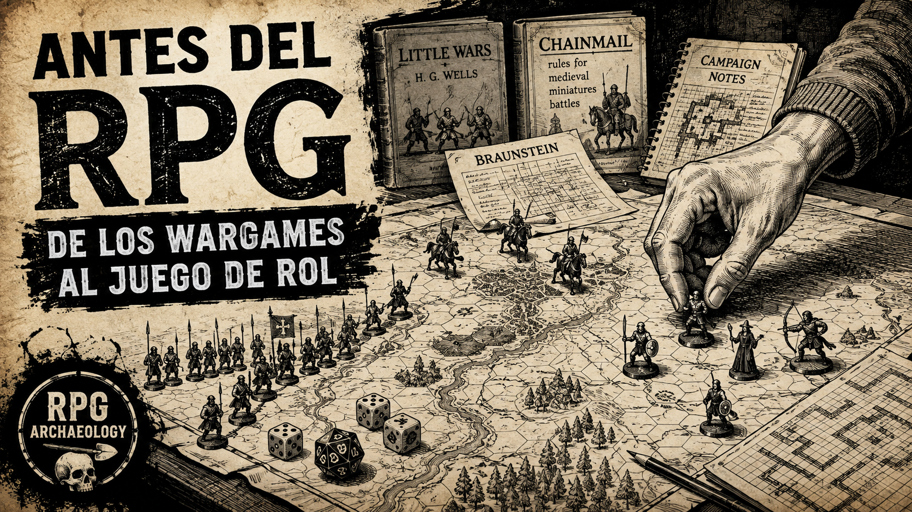

# Influences — From Wargames to Tabletop Role-Playing Games

> **Scope:** historical and conceptual antecedents leading from early military simulation games (wargames) to the emergence of the modern tabletop RPG.
>
> This document does not aim to establish a single inevitable line of descent. It collects innovations that, accumulated over nearly two centuries, would eventually become part of the language of role-playing games.


---

<figure markdown>

</figure>

[▶ Ver episodio en YouTube](https://youtu.be/8hvuzZrDd20)

---

## 1. Before the RPG: simulating war

Modern tabletop role-playing games did not appear in isolation.

One of their fundamental genealogies derives from **wargames**, which in turn evolved from earlier strategic games, especially chess variants.

The important transition was not simply representing a battle on a table.

It consisted of trying to turn aspects of a real battle into **rules, terrain, units, information, and simulable decisions**.

---

## 2. 1780 — Johann Christian Ludwig Hellwig

Before the famous *Kriegsspiel* of the Reisswitz, we find an important antecedent.

In 1780, **Johann Christian Ludwig Hellwig** published *Versuch eines aufs Schachspiel gebaueten taktischen Spiels von zwey und mehreren Personen zu spielen*.

His game still had a strong chess heritage, but introduced notably modern features:

* a much larger board;
* different types of terrain;
* units representing infantry, cavalry, and artillery;
* movement rules conditioned by terrain;
* configurable battlefields.

Hellwig sought to teach military principles through a playable simulation.

In 1803 he published a revised version titled *Das Kriegsspiel*.

### Contribution to the genealogy

**Abstract chess → terrain and units with military meaning.**

The board begins to represent a simulated space and not just an abstract structure for moving pieces.

---

## 3. 1811–1812 — Georg Leopold von Reisswitz

**Georg Leopold von Reisswitz**, Prussian military civil advisor and later baron, developed a considerably more ambitious system.

His *Kriegsspiel* gradually abandoned the chess board aspect to attempt representing a real battlefield.

Around 1811 he presented his system to members of the Prussian royal family and in **1812 an elaborate gaming apparatus was built/presented to King Friedrich Wilhelm III**.

It used modular terrain elements with which different battlefields could be reconstructed.

The objective was clearly shifting:

**war-inspired game → simulation of military operations.**

### Contributions to the genealogy

* terrain as representation of a world;
* spatial scale;
* configurable scenarios;
* units representing real forces;
* resolution of situations through rules and arbitral judgment.

Here begins to emerge a concept that will survive for a very long time:

> Players express decisions within a represented world and a system determines their consequences.

---

## 4. 1824 — Georg Heinrich Rudolf Johann von Reisswitz

The son of Georg Leopold, **Georg Heinrich Rudolf Johann von Reisswitz**, Prussian artillery officer, transformed his father's system profoundly.

In 1824 he published:

*Anleitung zur Darstellung militärischer Manöver mit dem Apparat des Kriegsspiels.*

His version is the famous **Prussian Kriegsspiel of 1824**.

One of his great innovations was abandoning his father's expensive three-dimensional terrain in favor of **military topographic maps**, approximately at scale 1:8000.

Units were represented by small blocks.

The system used data derived from real military situations to model:

* movement speed;
* effects of terrain;
* range;
* weapon effectiveness;
* casualties;
* degradation of units.

Dice introduced uncertainty into certain outcomes.

Another less visible but deeply significant innovation was that units could suffer **partial losses** and remain in combat, withstanding several enemy attacks before being completely eliminated. This cumulative damage absorption mechanism clearly anticipates the concept of **hit points** that would later characterize RPGs.

### The umpire

A specially important figure was the **umpire**.

Players did not necessarily have perfect access to the whole situation.

The umpire knew the real state of the scenario, received orders, and determined or communicated their consequences according to the rules and the situation.

This allowed representing something extraordinarily difficult via a conventional board:

**incomplete information and fog of war.**

### Contributions to the genealogy

* neutral umpire;
* world fully known by the umpire but only partially by players;
* resolution of actions;
* chance;
* quantitative rules;
* persistent consequences;
* partial damage absorption (precursor to hit points);
* open scenarios;
* defined objectives for each situation.

We are not yet at an RPG.

Players still control military forces, not adventure characters.

But a key piece of the future RPG already exists:

**player → declares intention → referee interprets the system → world responds.**

---

## 5. Rigid Kriegsspiel

The system derived from Reisswitz developed a considerable amount of rules, tables, and procedures.

This tradition would later be retrospectively known as **Rigid Kriegsspiel**.

Realism was sought through:

**more data + more precise rules + tables + calculations + controlled chance.**

This produced detailed simulations, but also a problem that will reappear countless times in game design history:

> The more detailed a simulation is, the more difficult it can be to play.

---

## 6. 1876 — Julius von Verdy du Vernois

Here appears a name that can be easily confused with the Reisswitz:

**Julius Adrian Friedrich Wilhelm von Verdy du Vernois.**

He was not a son of Reisswitz.

He was a Prussian officer who, decades later, proposed a radical transformation of Kriegsspiel.

In 1876 he published *Beitrag zum Kriegsspiel*.

Verdy considered that the numerous tables, calculations, and rules were becoming an obstacle to the very purpose of the exercise.

His proposal was to drastically reduce that machinery.

Instead of constantly consulting rules and tables, an experienced umpire could decide what happened using their professional knowledge and interpretation of the situation.

This tradition would become known as:

**Free Kriegsspiel.**

### Rigid Kriegsspiel

```
Situation → rules/tables/dice → result
```

### Free Kriegsspiel

```
Situation → umpire judgment → result
```

It does not necessarily mean absolute absence of rules or chance.

The important change is **where the final authority of the simulation resides**.

### Contribution to the RPG genealogy

Here appears, especially clearly, a principle that would later feel familiar to any RPG player:

> **Rules do not need to describe all possible actions if there exists a referee capable of interpreting unanticipated actions.**

The system no longer needs an explicit rule for every imaginable situation.

---

## 7. 1913 — H. G. Wells and *Little Wars*

In 1913, **H. G. Wells** published *Little Wars*.

Unlike the Prussian professional *Kriegsspiel*, Wells openly proposed a **recreational miniature wargame**.

Toy soldiers, scenery, movement, combat, and physical artillery formed a wargame designed fundamentally to play.

The book itself includes an appendix dedicated to its relationship with *Kriegsspiel*.

Wells knew that tradition, but sought something more accessible and entertaining.

### Contribution

With *Little Wars* another fundamental branch becomes very visible:

**military simulation → recreational hobby.**

Wargames no longer belong exclusively to professional training and can become a hobby practiced by enthusiasts.

This recreational wargaming culture will be the ground upon which, decades later, the first RPGs will emerge.

---

## 8. The leap from army to individual

For most of this story, the player controls:

**armies → divisions → units.**

To reach the RPG, one enormous conceptual change is still missing:

> What if instead of controlling an army we control a person?

This leap begins to become recognizable within certain American wargaming circles during the 1960s.

---

## 9. The American Branch — From Kriegsspiel to the American hobby

To understand the emergence of *Braunstein*, *Blackmoor*, and finally *Dungeons & Dragons*, an important leap remains to be explained:

**How did the wargaming tradition reach the United States?**

The answer does not seem to lie mainly in informal transmission through German immigration, but in a much more direct diffusion of European military practices.

During the 19th century, and especially after Prussian victories in the German wars of unification, the Prussian military system aroused enormous international interest.

The *Kriegsspiel* was part of that prestige.

Armies of other countries began to study, translate, and adapt the Prussian methods of military simulation.

---

### 9.1 Charles A. L. Totten — *Strategos*

In the United States, one of the first important examples was the officer **Charles Adiel Lewis Totten**.

In 1880 he published:

*Strategos: A Series of American Games of War, Based upon Military Principles and Designed for the Assistance Both of Beginners and Advanced Students in the Art of War.*

*Strategos* tried to provide the U.S. Army with its own simulation and training systems through war games.

Although belonging to the international *Kriegsspiel* tradition, Totten did not simply translate the Prussian system: he developed an American adaptation oriented toward the study and teaching of military problems.

We are still far from the RPG.

The fundamental unit remains military and the objective remains simulating operations.

But the essential principle has already crossed the Atlantic:

> A complex situation can be represented through a map, units, rules, limited information, and participant decisions.

---

### 9.2 William R. Livermore — *The American Kriegsspiel*

Another U.S. officer, **William Roscoe Livermore**, developed during the same period a system even more directly related to the German tradition.

His *The American Kriegsspiel* adapted ideas from various European authors and systems, especially German ones, attempting to build a simulation tool suitable for the U.S. Army.

Livermore explicitly studied the European literature on *Kriegsspiel*.

This provides an important documentary connection:

**19th-century American military wargaming knew and consciously adapted the Prussian tradition.**

Therefore, we do not need to assume an indirect transmission through immigrant communities to explain its arrival in the United States.

---

### 9.3 Two histories that should not be conflated too quickly

There is an obvious temptation to draw a direct line:

`Kriegsspiel → Totten/Livermore → Avalon Hill → Dungeons & Dragons`

Historical reality is more complex.

Between the American military wargaming experiments of the 19th century and the explosion of recreational wargaming in the mid-20th century, many decades pass, during which miniature games, commercial board games, literature on military simulation, and amateur communities evolve independently.

Therefore:

!!! success "DOCUMENTED FACT"
    The United States adopted and adapted the European *Kriegsspiel* within military contexts during the 19th century.

!!! success "DOCUMENTED FACT"
    during the 20th century, an important civil and commercial wargaming culture developed in the United States.

!!! warning "NOT ASSUMED"
    that there exists a direct and uninterrupted institutional chain between Totten or Livermore and the designers who would later create the RPG.

They are related strata of a larger history, but their concrete relationship must be demonstrated when evidence exists.

---

### 9.4 Charles S. Roberts and the modern commercial wargame

The next fundamental change occurs already in the 1950s.

**Charles S. Roberts** designed *Tactics*, commercially published in 1954.

Unlike the professional *Kriegsspiel*, *Tactics* was designed as a product that an enthusiast could buy and play.

In 1958 Roberts founded **Avalon Hill**, which would turn the historical board wargame into a recognizable commercial category through titles like *Tactics II* and *Gettysburg*.

The change is fundamental for our genealogy:

**wargames no longer need a military academy or a professional referee.**

They can be bought.

They can be played at home.

They can be modified.

They can be discussed in clubs.

They can generate communities of enthusiasts.

---

### 9.5 The ecosystem

During the 1950s and 1960s, the United States developed an increasingly active community around wargaming.

It was not only about buying games.

The following emerged and grew:

- clubs;
- associations;
- fanzines;
- magazines;
- conventions;
- campaigns;
- amateur design;
- rule variants;
- correspondence games;
- communities dedicated to historical miniatures.

Players modified existing systems and designed their own.

Fanzines and amateur publications served as connective tissue between geographically dispersed communities, normalizing the idea that any enthusiast could become a designer.

This culture is especially important because it turns the player into something more than a consumer:

> **the wargamer could easily become a designer.**

And that will precisely be the environment from which several of the earliest experiments that would shape the RPG will emerge.

---

### 9.6 The Midwest

A particularly important part of this story develops in **the American Midwest**.

During the 1960s, connected communities of enthusiasts appeared there through clubs, correspondence, publications, and conventions.

Among them was the **Midwest Military Simulation Association (MMSA)**, linked to players like **David Wesely** and **Dave Arneson**.

In Wisconsin, **Gary Gygax** participated in parallel in the wargaming community and in organizations and conventions of enthusiasts.

These communities did not work within large companies.

They were players modifying rules, creating scenarios, publishing material, organizing campaigns, and testing ideas among themselves.

This is the immediate breeding ground from which the role-playing game would emerge.

---

### 9.7 From Avalon Hill to a generation of designers

Commercial games helped introduce a new generation of American enthusiasts to wargaming.

Among them were future protagonists in the creation of the RPG.

**Gary Gygax** and **Dave Arneson** belonged to that culture of wargames, miniatures, clubs, and amateur design that flourished during the 1950s and 1960s.

But what was decisive was not only that they played wargames.

It was that they belonged to a culture where it was completely natural to:

**read some rules → discuss them → modify them → invent others → test them.**

That behavior will be fundamental to understand what happens next.

Because some players will begin to wonder what happens if the focus of the simulation stops being an army.

---

### 9.8 The bridge to Braunstein

In 1969, within that ecosystem, **David Wesely** organized his experimental *Braunstein*.

The map remains there.

The referee remains there.

The rules and simulation remain there.

But the human scale of the game changes.

Participants stop exclusively controlling military formations and begin to interpret **individuals with their own interests**.

After nearly two centuries of evolution, the fundamental unit of the simulation begins to shift:

```
Army

↓

Unit

↓

Individual
```

And at that moment, our archaeology stops following only the history of wargaming.

It begins to enter the history of the **role-playing game**.

---

### American line provisional

```
Prussian Kriegsspiel
        │
        ▼
International military diffusion
(19th century)
        │
        ▼
United States
        │
   ┌────┴─────┐
   ▼          ▼
Totten      Livermore
Strategos   American Kriegsspiel
1880        1880s
   │
   └────── American military simulation tradition

           · · · · · · · · ·
        [Do not assume a direct
         institutional chain]
           · · · · · · · · ·

         ▼
Recreational American wargaming
(20th century)
        │
        ▼
Charles S. Roberts
Tactics — 1954
        │
        ▼
Avalon Hill — 1958
        │
        ▼
Expansion of the wargaming hobby
        │
        ▼
Clubs / fanzines / conventions
amateur rules & campaigns
        │
        ▼
Midwest communities
        │
   ┌────┴─────────────┐
   ▼                  ▼
David Wesely      Dave Arneson
   │
   ▼
Braunstein — 1969
```

---

## 10. 1969 — David Wesely and Braunstein

**David Wesely**, member of the Midwest Military Simulation Association, organized in 1969 an experimental game set in the fictitious German city of **Braunstein**, during the Napoleonic wars.

The difference was extraordinary.

Players did not simply control opposing armies.

Each participant received **an individual role**.

It could be:

* an officer;
* the mayor;
* a banker;
* a student;
* or another character with their own interests.

Participants had different objectives and could interact in ways the designer had not fully anticipated.

Wesley acted as referee. This role —a neutral player who knows the real state and resolves the actions of others— goes back to *Kriegsspiel* and was adopted by American experiments like Totten's *Strategos* (1880), which directly influenced the format of Braunstein.

The game became considerably more chaotic than expected.

Precisely there something new appeared.

### Fundamental change

*Kriegsspiel* mainly asked:

> What orders do you give to your forces?

*Braunstein* could ask:

> **What does your character do?**

The difference seems small.

Historically, it is enormous.

---

## 11. From Braunstein to persistent characters

The ideas of *Braunstein* continued to be experimented with in the same circle.

Later variants, including the games of **Brownstone** by Duane Jenkins, began to use characters that could survive and reappear in later sessions.

This introduces another fundamental concept:

**the character persists beyond the scenario.**

The game stops being solely a battle or isolated situation.

A **campaign** begins to exist.

---

## 12. 1971 — Dave Arneson and Blackmoor

### The context of the Castle & Crusade Society

The environment in which *Blackmoor* emerged was not early isolation.

Already in **1970**, **Gary Gygax** —within the Wisconsin wargaming community— promoted the creation of the **Castle & Crusade Society** (C&CS) as a subgroup dedicated to medieval miniature combat, attached to the *International Federation of Wargaming*. Through its official fanzine, the *Domesday Book*, Gygax initially published the rules of *Chainmail* (no. 5, July 1970).

**Dave Arneson**, an experienced wargamer, was one of the first to join the C&CS in **April 1970**. The society organized a correspondence campaign —**The Great Kingdom**— on a shared map where each member was assigned a fief. Arneson was assigned the northern region: the **Barony of Blackmoor**, from which his campaign takes its name.

In **April 1971**, Arneson announced in his fanzine *Corner of the Table* the first session of his campaign, describing it as *"a medieval 'Braunstein'"*. In **July 1972**, he published in the *Domesday Book* no. 13 (*"Facts about Black Moor"*) one of the earliest known maps of the area. That same year, his work was shown to Gygax, marking the beginning of the collaboration that would produce *Dungeons & Dragons*.

One of the participants in Wesley's experiments was **Dave Arneson**.

Arneson took ideas from *Braunstein* and mixed them with:

* medieval wargaming;
* fantasy;
* persistent campaigns;
* individual characters;
* exploration;
* combat;
* progression.

His **Blackmoor** campaign, started in 1971, constitutes one of the fundamental direct precedents of *Dungeons & Dragons*.

Players controlled recurring characters within a fantasy world and could explore, among other things, the dungeons located beneath Castle Blackmoor.

Here many pieces finally begin to take a recognizable shape:

```
Wargame

↓

Referee

↓

Individual role

↓

Persistent character

↓

Campaign

↓

Fantasy world

↓

Dungeon exploration

↓

**Role-Playing Game**
```

---

## 13. Chainmail

In parallel, **Gary Gygax and Jeff Perren** developed *Chainmail*, published in 1971.

It was fundamentally a medieval miniature combat ruleset, but it incorporated fantasy rules with elements like heroes, wizards, and fantastic creatures.

Arneson used and adapted ideas from *Chainmail* during the development of *Blackmoor*.

He did not limit his adaptation to *Chainmail* rules as they were. After initially testing the fantasy supplement's combat table, he developed his own mix of mechanics—incorporating elements adapted from both *Chainmail* and the revision of his Civil War ironclad game (*Civil War Ironclads*)—introducing concepts like hit points and armor classes that would define modern RPG combat. The detailed process of this mechanical evolution—including specific changes in dice rolls—is complex and partially dependent on retrospective memories; its analysis is deferred to investigations dedicated to *Blackmoor*.

The later collaboration between **Dave Arneson and Gary Gygax** would eventually result in *Dungeons & Dragons*.

---

## 14. 1974 — Dungeons & Dragons

In 1974, the first edition of **Dungeons & Dragons** appeared.

It did not arise from a single invention.

It can be understood as the convergence of several traditions that had been developing for decades—and some for centuries:

### From wargames

* combat rules;
* miniatures;
* terrain;
* movement;
* probabilities;
* statistics;
* campaigns.

### From Kriegsspiel

* referee;
* asymmetric information;
* situation adjudication;
* simulated world broader than explicit rules.

### From Free Kriegsspiel

* referee's ability to resolve unanticipated actions;
* interpretation above a fully codified simulation.

### From Braunstein

* individual roles;
* personal objectives;
* free interaction;
* emergent actions.

### From Blackmoor

* persistent characters;
* fantasy world;
* progression;
* ongoing campaign;
* dungeon exploration.

### From Chainmail and fantasy wargaming

* medieval combat;
* heroes;
* magic;
* monsters;
* fantasy tradition within the wargaming hobby.

The modern RPG becomes recognizable when **the fundamental unit of play stops being the army and becomes the character**.

---

## 15. Genealogy line

```text
Chess / Strategy Games
        │
        ▼
Hellwig (1780)
Military terrain + specialized units
        │
        ▼
Reisswitz Sr. (1811–1812)
Physical battlefield simulation
        │
        ▼
Reisswitz Jr. (1824)
Maps + rules + dice + umpire
        │
        ├──────────────► Rigid Kriegsspiel
        │
        ▼
Verdy du Vernois (1876)
Free Kriegsspiel
Umpire judgment
        │
        ├──────────────────────────────┐
        │                              │
        ▼                              ▼
Professional wargaming      Recreational wargaming
        │                              │
        │                        H. G. Wells
        │                     Little Wars (1913)
        │                              │
        ▼                              ▼
International diffusion          Miniatures hobby
        │                              │
        ▼                              │
US military wargaming                  │
        │                              │
   ┌────┴─────┐                        │
   ▼          ▼                        │
Totten      Livermore                  │
Strategos   American Kriegsspiel       │
(1880)      (1880s)                    │
   │                                   │
   ▼                                   │
US military simulation                 │
   │                                   │
   ·                                   │
   ·  [No direct continuity assumed]   │
   ·                                   │
   └───────────────┐                   │
                    ▼                   ▼
              US recreational wargaming
                    │
                    ▼
              Charles S. Roberts
                Tactics (1954)
                    │
                    ▼
               Avalon Hill (1958)
                    │
                    ▼
           US wargaming community
           clubs / fanzines / cons
           amateur rules & campaigns
                    │
           ┌────────┴─────────┐
           │                  │
           ▼                  ▼
    Midwest simulation    Medieval/Fantasy
        community            Wargaming
           │                  │
           ▼                  ▼
    Braunstein (1969)    Chainmail (1971)
      David Wesely        Gygax / Perren
           │                  │
           ▼                  │
     Individual roles          │
            │                  │
            ▼                  │
     Dave Arneson              │
            │                  │
            ▼                  │
     Castle & Crusade Society  │
         (1970)                 │
     · Chainmail · Domesday    │
     · Great Kingdom           │
            │                  │
            ▼                  │
     Blackmoor (1971)          │
           │                  │
           └────────┬─────────┘
                    ▼
           Arneson + Gary Gygax
                    │
                    ▼
            Dungeons & Dragons
                   1974
```

---

## 16. An observation for RPG Archaeology

The genealogy is especially interesting because many characteristics that today we associate with the RPG **did not emerge simultaneously**.

They appeared as responses to different problems.

The **die** helped represent uncertainty.

The **referee** allowed hiding information and resolving situations.

The **rules** attempted to model a world.

Free Kriegsspiel discovered that the referee could cover what the rules did not contemplate.

*Braunstein* turned the participant into an individual with their own objectives.

*Blackmoor* turned that individual into a persistent character within a fantasy campaign.

The **organizational ecosystem** —fanzines, correspondence campaigns, and associations like the *Castle & Crusade Society*— solved the problem of geographic dispersion of player communities, facilitating the convergence of ideas that otherwise would have remained isolated.

*Dungeons & Dragons* gathered those pieces and turned them into a new recognizable type of game.

Perhaps one of the recurring questions of RPG Archaeology should be precisely:

> **What problem was a mechanic originally trying to solve before becoming a genre convention?**

---

## 17. Notes for RPG Archaeology

| Period / Work | Relevant Innovation / Contribution | Problem it addressed |
|---|---|---|
| 1780 — Hellwig | Tactical terrain and specialized units | Overcome part of chess abstraction to represent military problems |
| 1824 — Reisswitz Jr. | Topographic maps, tables, dice, umpire (umpire) and partial hit points | Represent terrain, uncertainty, limited information and military results systematically |
| 1876 — Verdy du Vernois | Free Kriegsspiel: greater weight of umpire judgment vs. rigid procedures | Reduce the rule and calculation load that could hinder the exercise |
| 1913 — H. G. Wells | Miniatures and explicitly recreational wargaming with *Little Wars* | Turn simulated miniatures war into an accessible game for enthusiasts |
| 1954–1958 — Roberts / Avalon Hill | Modern commercial wargame; hexagonal board and self-contained games | Make board wargaming feasible and marketable for the amateur audience |
| 1969 — David Wesely | *Braunstein*: individual roles, personal goals and arbitrary interaction | Expand the military scope to allow individual participants and actions outside conventional confrontation |
| 1970 — C&CS / Gygax | *Domesday Book*, Great Kingdom by correspondence | Geographically connect player communities and facilitate designer collaborations |
| 1971 — Dave Arneson | *Blackmoor*: persistent characters, fantasy, exploration and campaign | Turn the individual role into a continued experience within a shared world |
| 1974 — Gygax & Arneson | *Dungeons & Dragons*: first commercial publication of a tabletop RPG | Systematize and commercially publish a new form of game centered on characters and adjudicated campaigns |

---

## Initial sources

* Johann Christian Ludwig Hellwig — *Versuch eines aufs Schachspiel gebaueten taktischen Spiels* (1780).
* Georg Leopold von Reisswitz — three-dimensional gaming apparatus (1812).
* Georg Heinrich Rudolf Johann von Reisswitz — *Anleitung zur Darstellung militärischer Manöver mit dem Apparat des Kriegsspiels* (1824).
* Julius von Verdy du Vernois — *Beitrag zum Kriegsspiel* (1876).
* C. A. L. Totten — *Strategos: A Series of American Games of War* (1880).
* William R. Livermore — *The American Kriegsspiel* (1882).
* H. G. Wells — *Little Wars* (1913).
* David Wesely — *Braunstein* experiments (1969); partially published in *The Midwest Military Simulation Association Newsletter*.
* Gary Gygax & Jeff Perren — *Chainmail* (1971); first publication in *Domesday Book* no. 5 (1970).
* Gary Gygax — *Castle & Crusade Society* and *Domesday Book* (1970–1972); *Great Kingdom* correspondence campaign.
* Dave Arneson — *Blackmoor* campaign (1971); "Facts about Black Moor" in *Domesday Book* no. 13 (1972).
* Gary Gygax & Dave Arneson — *Dungeons & Dragons* (1974).
* Jon Peterson — *Playing at the World*.
* Shannon Appelcline — *Designers & Dragons*.
* Historical studies on *Kriegsspiel*, *Braunstein*, *Blackmoor*, *Castle & Crusade Society* and the origins of the role-playing game.

---

### Curiosity — From Prussia to modern German board game culture

It is tempting to observe the Prussian origin of *Kriegsspiel* and relate it to the extraordinary modern board game culture in Germany.

There is certainly a long German history of regulated games and *Kriegsspiel* constitutes an especially early and influential episode: during the 19th century, the game came to be used as a professional tool for military training and simulation.

Germany would become again during the 20th century one of the great centers of board game culture. The development of the modern *Brettspiel*, the emergence of the **Spiel des Jahres** in 1978, and later the enormous international weight of so-called *German-style games* or *Eurogames* are much more recent manifestations of that culture.

However, **RPG Archaeology does not currently consider demonstrated a direct causal line between the Prussian *Kriegsspiel* and the modern German board game tradition**. They are phenomena separated by enormous historical, social, and cultural changes.

The continuity is interesting as cultural context; turning it into a genealogy would require specific historical evidence.

> **Archaeological note:** that two strata lie one above the other does not necessarily mean the upper one descends from the lower one. 😄


**Status:** initial document / subject to expansion and correction during the research.
