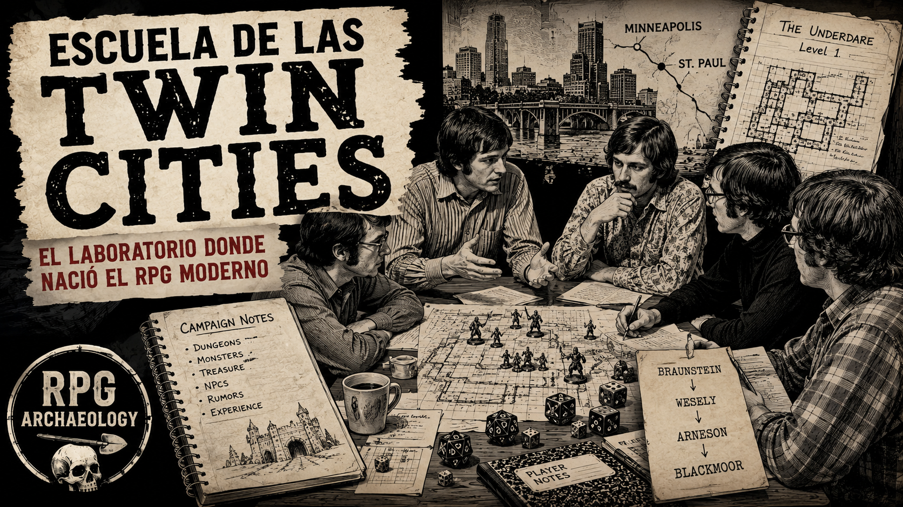

# The Twin Cities School — El laboratorio antes de D&D


---

<figure markdown>

</figure>

[▶ Ver episodio en YouTube](https://youtu.be/uyHjtO0QtMw)

---

## 1. Propósito de la investigación

La historia popular de *Dungeons & Dragons* suele condensarse alrededor de dos nombres:

Dave Arneson y Gary Gygax.

La atribución es comprensible: ambos figuran como cocreadores del juego publicado en 1974.

Sin embargo, al retroceder unos pocos años aparece una historia bastante más colectiva.

Antes de *Blackmoor*, antes de *Dungeons & Dragons* y antes de TSR, existía en el área de Minneapolis–St. Paul, Minnesota, una activa comunidad de aficionados al wargaming.

Dentro de ella participaron personas como:

- David Wesely;
- Dave Arneson;
- David Megarry;
- Greg Svenson;
- John Snider;
- Richard Snider;
- Duane Jenkins;
- y otros jugadores y diseñadores.

No formaban una "escuela" en sentido académico ni utilizaron necesariamente ese término para describirse.

En RPG Archaeology utilizaremos provisionalmente:

**The Twin Cities School**

como etiqueta para estudiar aquel ecosistema de jugadores, referees y diseñadores que, mediante sucesivos experimentos con el wargaming, desarrollaron prácticas que terminarían siendo fundamentales para el nacimiento del RPG.

La pregunta central será:

> ¿Qué ocurrió en las Twin Cities para que un grupo de wargamers comenzara a jugar de una manera que ya no encajaba completamente dentro del wargame tradicional?

## 2. Una precaución: no buscar un único inventor

Una genealogía excesivamente sencilla podría escribirse así:

```text
WARGAMES
    ↓
ARNEson
    ↓
BLACKMOOR
    ↓
D&D
```

Pero esta representación elimina precisamente el entorno experimental que hizo posible *Blackmoor*.

La evidencia histórica disponible muestra intercambio de ideas entre jugadores, modificación constante de reglas y experimentos anteriores que introdujeron elementos posteriormente reconocibles en el RPG.

Por tanto, esta investigación parte de una hipótesis metodológica diferente:

**El RPG no apareció mediante una única invención puntual. Surgió mediante acumulación, recombinación y estabilización de diferentes prácticas de juego.**

Esto no elimina la importancia individual de Arneson, Wesely, Gygax u otros.

Permite entender qué hizo realmente cada uno.

## 3. Las Twin Cities y el wargaming

Durante los años sesenta existía en Minneapolis–St. Paul una comunidad activa de aficionados a los juegos de guerra.

Como en otras comunidades estadounidenses del período, sus participantes:

- jugaban wargames comerciales;
- diseñaban variantes;
- escribían reglas propias;
- organizaban campañas;
- intercambiaban ideas;
- participaban en clubes;
- utilizaban correspondencia y publicaciones amateur.

El wargaming de la época no debe imaginarse únicamente como consumidores jugando productos terminados.

Una parte importante del hobby consistía precisamente en modificar el juego.

```text
REGLAMENTO
    ↓
PARTIDA
    ↓
PROBLEMA / IDEA
    ↓
HOUSE RULE
    ↓
VARIANTE
    ↓
NUEVA PARTIDA
```

Esta cultura de modificación resulta fundamental para comprender lo que ocurrirá después.

## 4. David Wesely

Una de las figuras centrales de este entorno fue David Wesely.

Wesely era wargamer y diseñador amateur, pero también estaba profundamente interesado en un problema que acompañaba al wargaming desde el *Kriegsspiel*:

> ¿Cómo puede un árbitro resolver situaciones que las reglas no han previsto explícitamente?

Ese problema le llevó hacia sistemas de arbitraje y posteriormente al desarrollo de *Strategos*.

## 5. Strategos y la tradición del referee

El nombre *Strategos* tiene una genealogía anterior.

En 1880 el oficial estadounidense Charles A. L. Totten había publicado:

*Strategos: A Series of American Games of War.*

La obra pertenecía a la tradición de adaptación estadounidense del *Kriegsspiel* europeo.

Décadas después Wesely recuperó ideas relacionadas con esta tradición de juegos arbitrados para sus propios experimentos.

El elemento importante para nuestra genealogía no es una transmisión mecánica directa de todas sus reglas.

Es la supervivencia de una figura:

el referee.

En el wargaming tradicional, el árbitro podía:

- mantener información oculta;
- conocer el estado completo de la situación;
- recibir órdenes de los jugadores;
- interpretar reglas;
- resolver situaciones ambiguas;
- comunicar únicamente la información disponible para cada participante.

Podemos representar este modelo:

```text
JUGADOR A ──┐
             │
             ▼
          REFEREE
             ▲
             │
JUGADOR B ──┘
             │
             ▼
        ESTADO REAL
        DEL ESCENARIO
```

Este mecanismo será crucial para lo que ocurrirá después.

## 6. Braunstein

En 1969, David Wesely organizó una partida experimental que posteriormente sería conocida como *Braunstein*.

El escenario representaba una ciudad ficticia alemana durante un contexto militar napoleónico.

El experimento comenzó como una variación sobre los juegos de guerra tradicionales.

Pero Wesely introdujo una modificación decisiva.

En lugar de limitarse a comandar ejércitos, diferentes participantes recibieron roles individuales dentro de la ciudad.

Podían representar, por ejemplo:

- oficiales;
- autoridades locales;
- estudiantes;
- revolucionarios;
- personajes con intereses propios.

Cada participante podía poseer:

- información diferente;
- objetivos particulares;
- relaciones distintas con los demás;
- posibilidades de actuación que no estaban completamente previstas por las reglas.

El centro de la partida empezó a desplazarse.

Ya no era únicamente:

> ¿Qué hacen mis tropas?

Ahora podía ser:

> ¿Qué hago yo?

## 7. El accidente productivo

Una de las características más importantes de *Braunstein* es que buena parte de lo que posteriormente resultaría interesante no estaba necesariamente planificado como nacimiento de un nuevo género.

Los participantes comenzaron a:

- negociar;
- engañarse;
- conspirar;
- separarse;
- perseguir objetivos personales;
- realizar acciones que Wesely no había previsto.

Esto produjo una situación aparentemente problemática.

Las reglas disponibles no podían describir todas las acciones posibles.

Pero Wesely disponía de una herramienta procedente del wargaming arbitrado:

el referee.

Cuando un jugador declaraba una acción no prevista, Wesely podía decidir qué ocurría.

```text
JUGADOR
   │
   │ "Quiero hacer X"
   ▼
REFEREE
   │
   │ interpreta situación
   │ aplica reglas si existen
   │ adjudica si no existen
   ▼
MUNDO RESPONDE
```

Aquí aparece uno de los principios fundamentales del RPG de mesa:

**El espacio de acciones posibles puede ser mayor que el espacio de reglas escritas.**

El referee cubre la diferencia.

## 8. Del control de unidades al rol individual

El cambio parece pequeño:

```text
ANTES


Jugador
   ↓
Ejército / unidad

frente a:

BRAUNSTEIN


Jugador
   ↓
Individuo
```

Pero sus consecuencias son enormes.

Cuando el jugador controla un individuo, empiezan a importar cuestiones que en un wargame tradicional pueden resultar secundarias:

- identidad;
- motivaciones;
- información personal;
- relaciones;
- posición concreta;
- supervivencia;
- decisiones individuales.

El participante deja de observar exclusivamente la batalla desde arriba.

Empieza a habitar la situación desde dentro.

No tenemos todavía necesariamente un RPG completo.

Pero uno de sus cambios fundamentales de perspectiva ya está presente.

## 9. Braunstein no era todavía Dungeons & Dragons

Debemos evitar interpretar *Braunstein* retrospectivamente como si Wesely hubiera organizado una sesión moderna de RPG.

!!! success "HECHO DOCUMENTADO"

    >*Braunstein* introdujo roles individuales, objetivos diferenciados, información incompleta y adjudicación mediante referee.

!!! tip "INFERENCIA HISTÓRICA"

    >Estas características constituyen antecedentes claros de prácticas posteriormente centrales en los juegos de rol.

!!! warning "PRECAUCIÓN"

    >Eso no significa que *Braunstein* contuviera ya todos los elementos que posteriormente definirían el RPG:

    - campaña persistente;
    - personaje persistente desarrollado durante numerosas sesiones;
    - progresión sistemática;
    - dungeon crawl;
    - clases;
    - niveles;
    - sistema de experiencia;
    - estructura moderna de grupo de aventureros.

    Es precisamente la evolución posterior la que nos interesa.

## 10. El experimento continúa

El éxito —o productivo caos— de *Braunstein* llevó a nuevas partidas y variantes.

Otros participantes comenzaron a experimentar con el formato.

Esto es importante porque cambia nuestra genealogía.

No tenemos:

```text
Wesely
   ↓
inventa sistema
   ↓
Arneson lo copia
```

Tenemos algo más parecido a:

```text
WESELY
   │
   ▼
BRAUNSTEIN
   │
   ▼
JUGADORES
   │
   ├── prueban
   ├── modifican
   ├── reinterpretan
   └── crean variantes
        │
        ▼
    NUEVOS EXPERIMENTOS
```

La innovación empieza a circular dentro del grupo.

## 11. Dave Arneson entra en escena

Dave Arneson pertenecía a esta comunidad y participó en los experimentos de Wesely.

Posteriormente comenzó a desarrollar sus propias partidas.

En abril de 1971 existe evidencia contemporánea de que Arneson estaba preparando lo que describió como un:

> **"medieval Braunstein"**

La expresión es extraordinariamente importante.

Nos proporciona un vínculo documental entre:

```text
BRAUNSTEIN
     ↓
MEDIEVAL BRAUNSTEIN
     ↓
BLACKMOOR
```

No necesitamos reconstruir retrospectivamente toda la relación.

Los propios participantes estaban utilizando el vocabulario de *Braunstein* para describir el nuevo experimento.

## 12. Blackmoor

El experimento de Arneson terminó convirtiéndose en *Blackmoor*.

Aquí varias ideas que habían aparecido anteriormente comenzaron a combinarse dentro de una estructura más estable.

*Blackmoor* incorporó progresivamente:

- personajes individuales;
- continuidad entre sesiones;
- mundo persistente;
- exploración;
- combate;
- aventuras;
- dungeon;
- progresión;
- tesoros;
- campañas;
- interacción con personajes y facciones;
- referee;
- reglas modificadas durante el propio juego.

La diferencia fundamental podría expresarse así:

```text
BRAUNSTEIN


situación
   ↓
personaje individual
   ↓
objetivo
   ↓
resolución

frente a:

BLACKMOOR


personaje individual
      ↓
aventura
      ↓
sobrevive
      ↓
regresa
      ↓
progresa
      ↓
nueva aventura
      ↓
mismo mundo
```

Aparece la persistencia.

Y con ella cambia profundamente la naturaleza del juego.

## 13. Blackmoor como cristalización

Aquí debemos ser especialmente precisos.

Decir:

> "Dave Arneson inventó el RPG."

es una afirmación demasiado absoluta para el estado de nuestra investigación.

Pero decir:

> "Blackmoor constituye una de las primeras campañas donde numerosos elementos fundamentales del RPG aparecen combinados de manera persistente y reconocible."

resulta mucho más defendible.

Los testimonios posteriores de participantes de las Twin Cities atribuyen a Arneson un papel central en esa cristalización.

Una razón importante es que Arneson llevó el experimento hacia una campaña continuada y dejó documentación sobre ella.

Por eso *Blackmoor* ocupa una posición diferente a los *Braunstein* anteriores.

No necesariamente porque cada elemento fuese inventado allí.

Sino porque allí muchos de ellos comenzaron a funcionar juntos.

## 14. David Megarry

Otro participante fundamental fue David Megarry.

Megarry jugó en *Blackmoor* como H. W. Dumbo y participó en las expediciones al dungeon.

Su experiencia produjo posteriormente otro artefacto históricamente importante:

*Dungeon!*

El juego de tablero reducía parte de la experiencia del dungeon crawl a una estructura mucho más formalizada:

```text
DUNGEON
   ↓
habitaciones
   ↓
monstruos
   ↓
combate
   ↓
tesoro
   ↓
progresión por el espacio
```

Esto resulta fascinante para RPG Archaeology.

*Blackmoor* estaba generando descendientes diferentes.

Uno terminará contribuyendo a *D&D*.

Otro podía abstraer el dungeon crawl hacia un juego de tablero.

La misma experiencia estaba siendo interpretada desde perspectivas distintas.

## 15. Los mapas de Megarry

Megarry conservó además mapas realizados durante sus exploraciones de *Blackmoor*.

Estos documentos constituyen una de nuestras fuentes más interesantes.

No representan simplemente un dungeon diseñado posteriormente.

Representan la percepción espacial de un jugador durante una campaña temprana anterior a la publicación de *D&D*.

Megarry explicó posteriormente que los jugadores:

- no veían el mapa de Arneson;
- recibían descripciones;
- escuchaban distancias;
- recibían dimensiones de habitaciones;
- conocían salidas y escaleras mediante la descripción;
- dibujaban sus propios mapas sobre papel cuadriculado.

Por tanto:

```text
MAPA DE ARNESON
      ↓
DESCRIPCIÓN
      ↓
PERCEPCIÓN
      ↓
CROQUIS
      ↓
MAPA DE MEGARRY
```

Esta cuestión se estudia detalladamente en:

*Blackmoor — Spatial Archaeology*

## 16. Greg Svenson y Tonisborg

Greg Svenson, otro participante del entorno de las Twin Cities y jugador temprano de *Blackmoor*, desarrolló su propio dungeon:

*Tonisborg*.

Su importancia para nuestra genealogía es considerable.

*Tonisborg* demuestra que el dungeon no permaneció exclusivamente como:

> "la cosa que dirige Dave Arneson."

Otros participantes comenzaron a construir y dirigir sus propios espacios de aventura.

Esto implica una transferencia de conocimiento.

```text
ARNESON
   ↓
BLACKMOOR
   ↓
JUGADORES
   ↓
comprenden el formato
   ↓
CREAN SUS PROPIOS DUNGEONS
```

Cuando una práctica puede ser reproducida por otros, estamos ante algo mucho más importante que una peculiaridad personal del referee original.

Estamos viendo aparecer una forma de juego transmisible.

## 17. El referee como tecnología

Uno de los descubrimientos más interesantes de toda nuestra genealogía es la continuidad del referee.

Podemos seguir aproximadamente esta línea:

```text
KRIEGSSPIEL
     │
     ▼
UMPIRE
interpreta situación militar
     │
     ▼
FREE KRIEGSSPIEL
juicio > regla exhaustiva
     │
     ▼
WESELY
BRAUNSTEIN
     │
     ▼
REFEREE
resuelve acciones individuales
     │
     ▼
ARNESON
BLACKMOOR
     │
     ▼
REFEREE
mantiene mundo persistente
```

No significa que exista una transmisión lineal perfecta entre cada elemento.

Pero sí aparece una continuidad conceptual:

un humano situado entre las reglas y el mundo puede interpretar acciones que el sistema no ha formalizado completamente.

Esta capacidad será fundamental para el RPG.

## 18. La libertad aparece antes que las reglas

En un juego completamente cerrado:

```text
ACCIONES POSIBLES
      =
ACCIONES REGLADAS
```

En los experimentos de las Twin Cities comienza a aparecer algo diferente:

```text
ACCIONES POSIBLES
      >
ACCIONES REGLADAS
```

El jugador puede intentar algo que nadie escribió previamente.

El referee decide cómo responder.

**Esta sencilla desigualdad puede ser una de las transformaciones conceptuales más importantes de toda la genealogía del RPG.**

Permite que el jugador deje de seleccionar únicamente opciones disponibles dentro del sistema.

Puede empezar a declarar intenciones.

## 19. Diseñar mediante el juego

Otro patrón común parece ser la ausencia de una separación rígida entre:

```text
DISEÑO
  ↓
PRODUCTO TERMINADO
  ↓
PLAYTEST
```

La práctica parece mucho más iterativa:

```text
IDEA
  ↓
PARTIDA
  ↓
SITUACIÓN IMPREVISTA
  ↓
ADJUDICACIÓN
  ↓
NUEVA REGLA
  ↓
SIGUIENTE PARTIDA
```

En otras palabras:

**el juego estaba siendo descubierto mientras se jugaba.**

Esta característica será especialmente visible en *Blackmoor*.

## 20. Una cultura oral

Existe además un problema historiográfico importante.

Gran parte de estas innovaciones no apareció inicialmente en manuales comerciales.

Circulaba mediante:

- partidas;
- conversaciones;
- correspondencia;
- clubes;
- fanzines;
- notas privadas;
- reglas mecanografiadas;
- demostraciones.

Esto explica por qué reconstruir la genealogía resulta tan difícil.

Una idea podía existir durante meses antes de aparecer documentada.

Otra podía ser utilizada por varios participantes sin que sepamos exactamente quién la introdujo primero.

Y décadas después, los recuerdos de los protagonistas podían diferir.

Por tanto debemos distinguir siempre:

primera evidencia documental conocida

de

primera utilización real.

No son necesariamente lo mismo.

## 21. Secrets of Blackmoor

El documental *Secrets of Blackmoor* constituye una fuente especialmente interesante para reconstruir este entorno.

[Secrets of Blackmoor — sitio oficial](https://secretsofblackmoor.com/)

Su principal valor para RPG Archaeology reside en reunir testimonios posteriores de numerosos participantes vinculados a la escena original.

Entre ellos aparecen recuerdos sobre:

- *Braunstein*;
- Wesely;
- Arneson;
- *Blackmoor*;
- las primeras campañas;
- métodos de referee;
- evolución de reglas;
- cultura de los jugadores de las Twin Cities.

### CLASIFICACIÓN DE FUENTE

Debe tratarse principalmente como:

!!! quote "TESTIMONIO POSTERIOR DE PARTICIPANTES"

    y no como documentación contemporánea de 1969–1971.

    Esto no reduce su enorme valor.

    Simplemente obliga a contrastar, cuando sea posible, afirmaciones concretas con:

    - documentos contemporáneos;
    - fanzines;
    - mapas;
    - manuscritos;
    - correspondencia;
    - publicaciones tempranas.

## 22. Una innovación colectiva

Después de estudiar este ecosistema, resulta difícil mantener una genealogía puramente individual.

Una representación más adecuada sería:

```text
                 WARGAMING
                     │
                     ▼
              TWIN CITIES SCENE
                     │
        ┌──────────┬──────────┐
        │                     │
        ▼                     ▼
     WESELY                OTROS
        │              EXPERIMENTOS
        ▼                     │
    BRAUNSTEIN                │
        │                     │
        └──────────┬──────────┘
                   ▼
                ARNESON
                     │
                     ▼
                 BLACKMOOR
                     │
        ┌────────────┼────────────┐
        │            │            │
        ▼            ▼            ▼
     MEGARRY      SVENSON      OTROS
     Dungeon!     Tonisborg   experimentos
```

*Blackmoor* ocupa el centro porque terminó siendo la rama históricamente decisiva para *D&D*.

Pero sus raíces pertenecen a un ecosistema.

## 23. Y mientras tanto, en Lake Geneva...

La historia todavía no está completa.

Mientras las Twin Cities experimentaban con personajes, referees y campañas, otra comunidad de wargaming estaba desarrollando sistemas diferentes.

En Wisconsin, Jeff Perren y Gary Gygax habían trabajado sobre reglas medievales que terminarían publicándose en 1971 como:

*Chainmail*.

Su evolución estaba siguiendo otro camino:

```text
WARGAMING
    ↓
COMBATE MEDIEVAL
    ↓
REGLAS FORMALIZADAS
    ↓
FANTASY SUPPLEMENT
    ↓
HEROES / WIZARDS / MONSTERS
```

Tenemos por tanto dos líneas contemporáneas:

```text
TWIN CITIES                     LAKE GENEVA

Wesely                           Perren
   │                               │
Braunstein                        │
   │                               ▼
Arneson                       Perren + Gygax
   │                               │
Blackmoor                      Chainmail
   │                               │
   │                               │
   └───────────────┐ ┌─────────────┘
                   ▼ ▼
                      ?
```

Ese signo de interrogación terminará llamándose:

*Dungeons & Dragons*.

## 24. No eran dos mundos aislados

Tampoco debemos interpretar Twin Cities y Lake Geneva como dos laboratorios completamente independientes.

Las comunidades estadounidenses de wargaming estaban conectadas mediante:

- asociaciones;
- convenciones;
- correspondencia;
- fanzines;
- publicaciones;
- campañas compartidas.

Dave Arneson perteneció a la *Castle & Crusade Society*, organización fundada por Gary Gygax y Robert Kuntz.

Existía, por tanto, circulación entre ambos entornos antes de que *D&D* existiera.

La genealogía real se parece más a una red que a un árbol.

## 25. De comunidad experimental a producto

Aquí aparece una transición que deberá estudiarse en el documento dedicado a *D&D*.

La cultura de las Twin Cities funcionaba extraordinariamente bien para generar nuevas formas de juego.

Pero una campaña doméstica puede depender enormemente de conocimiento implícito.

*Blackmoor* podía funcionar porque:

**Dave Arneson estaba allí.**

Un producto comercial necesita resolver otro problema:

> **¿Cómo consigue alguien que nunca ha conocido a Arneson reproducir una experiencia parecida?**

Eso exige convertir parte del conocimiento oral en:

- reglas;
- procedimientos;
- tablas;
- ejemplos;
- terminología;
- documentación.

Aquí comenzará a cobrar especial importancia la convergencia con Gary Gygax y su experiencia escribiendo y publicando reglas.

## 26. La cuestión de la autoría

Esta genealogía también obliga a utilizar cuidadosamente la palabra inventor.

Podemos identificar contribuciones importantes:

**David Wesely**

>*Braunstein* y la utilización de personajes individuales con objetivos propios dentro de un escenario arbitrado.

**Dave Arneson**

>La transformación y consolidación de aquellas prácticas dentro de una campaña fantástica persistente que terminaría siendo *Blackmoor*.

**David Megarry**

>Participación en *Blackmoor*, cartografía temprana y posterior abstracción del dungeon crawl en *Dungeon!*.

**Greg Svenson**

>Participación temprana y reproducción del formato mediante *Tonisborg*.

**Gary Gygax y Jeff Perren**

>Desarrollo paralelo de *Chainmail*, proporcionando otro importante vocabulario de reglas medievales y fantásticas.

Pero ninguna lista captura completamente el proceso.

La innovación circulaba.

## 27. ¿Inventó Arneson el RPG?

Después de esta investigación podemos responder con mayor precisión.

!!! failure "FORMULACIÓN DEMASIADO FUERTE"

    >Dave Arneson inventó él solo el juego de rol.

!!! failure "FORMULACIÓN DEMASIADO DÉBIL"

    >Arneson simplemente añadió fantasía a los wargames.

!!! abstract "FORMULACIÓN PROVISIONAL"

    >Dave Arneson fue la figura central en la consolidación de *Blackmoor*, una de las primeras campañas conocidas donde diferentes innovaciones procedentes del wargaming y de los experimentos de *Braunstein* se combinaron en una forma persistente de juego claramente reconocible como antecedente directo del RPG moderno.

    Su importancia no exige borrar a Wesely ni a los demás.

    Al contrario.

    Comprender el ecosistema permite apreciar mejor qué transformación concreta realizó Arneson.

## 28. ¿Por qué Blackmoor y no Braunstein?

Ésta es probablemente una de las preguntas fundamentales.

*Braunstein* había introducido una ruptura decisiva:

el individuo dentro del escenario.

*Blackmoor* parece haber añadido algo igualmente importante:

el individuo continúa existiendo después del escenario.

Ese cambio introduce:

```text
PERSONAJE
   +
PERSISTENCIA
   +
MUNDO
   +
PROGRESIÓN
   +
REFEREE
   =
CAMPAÑA
```

Cuando una sesión termina, el juego no vuelve necesariamente a cero.

El personaje tiene historia.

El mundo tiene memoria.

Y ambos pueden cambiar.

Ahí empezamos a reconocer claramente el RPG.

## 29. Síntesis arqueológica

La conclusión provisional de RPG Archaeology sería:

**The Twin Cities School no fue una escuela formal, sino un ecosistema de experimentación wargamers en el que diferentes jugadores comenzaron a ampliar el espacio de posibilidades más allá de las reglas tradicionales.**

David Wesely y *Braunstein* demostraron que un participante podía controlar un individuo con objetivos propios dentro de un escenario arbitrado.

Dave Arneson llevó esas posibilidades hacia una campaña fantástica persistente en *Blackmoor*.

Los jugadores de *Blackmoor* no fueron consumidores pasivos.

Cartografiaron, experimentaron, diseñaron y reprodujeron el nuevo formato.

David Megarry desarrolló *Dungeon!*.

Greg Svenson desarrolló *Tonisborg*.

Otros participantes contribuyeron con ideas, personajes, reglas y experiencias.

Por tanto:

**Blackmoor no apareció en el vacío. Fue la cristalización más influyente de un laboratorio colectivo.**

## 30. El estrato siguiente

Nuestra genealogía queda ahora:

```text
KRIEGSSPIEL
      │
      ▼
FREE KRIEGSSPIEL
      │
      ▼
RECREATIONAL WARGAMING
      │
      ▼
AMERICAN WARGAMING COMMUNITY
      │
      ├───────────────────────┐
      │                       │
      ▼                       ▼
TWIN CITIES              LAKE GENEVA
      │                       │
   WESELY                    PERREN
      │                       │
 BRAUNSTEIN                   ▼
      │                 PERREN + GYGAX
   ARNESON                    │
      │                   CHAINMAIL
 BLACKMOOR                    │
      │                       │
      └───────────┬───────────┘
                  ▼
         ARNESON + GYGAX
                  │
                  ▼
        DUNGEONS & DRAGONS
                1974
```

Éste será el punto de partida del siguiente documento:

*Dungeons & Dragons — Arneson y Gygax: la historia de D&D*

Allí dejaremos de estudiar los laboratorios por separado.

Estudiaremos qué ocurrió cuando convergieron.

## 31. Preguntas abiertas

Esta primera excavación deja varios asuntos para futuras investigaciones:

- ¿Qué reglas concretas utilizaban los primeros *Braunstein*?
- ¿Cómo evolucionaron entre una partida de Wesely y otra?
- ¿Qué elementos adoptó directamente Arneson?
- ¿Cuáles modificó?
- ¿Qué innovaciones surgieron específicamente durante *Blackmoor*?
- ¿Qué aportaciones pueden documentarse de otros jugadores de las Twin Cities?
- ¿Hasta qué punto *Tonisborg* reproduce procedimientos de *Blackmoor*?
- ¿Qué relación exacta existe entre la experiencia de Megarry en *Blackmoor* y *Dungeon!*?
- ¿Qué documentación contemporánea sobre las primeras sesiones permanece accesible?
- ¿Cuándo comienza exactamente la persistencia sistemática de personajes?
- ¿Cuándo aparece la progresión mecánica?
- ¿Cómo se resolvían originalmente movimiento, tiempo y exploración?
- ¿Qué ideas viajaron desde Twin Cities hasta Lake Geneva antes de la demostración de *Blackmoor*?
- ¿Qué elementos que posteriormente atribuimos a *D&D* estaban ya circulando colectivamente entre wargamers?

## 32. Fuentes iniciales y clasificación

### Testimonios de participantes

[Secrets of Blackmoor — sitio oficial](https://secretsofblackmoor.com/)

Documental construido alrededor de testimonios posteriores de participantes del entorno de *Blackmoor* y las Twin Cities.

Debe utilizarse como fuente oral retrospectiva, contrastando afirmaciones concretas cuando exista documentación contemporánea.

### Investigación sobre Blackmoor y cartografía

*Hidden in Shadows* — Daniel H. Boggs

Especialmente útil para documentación temprana, mapas, testimonios de David Megarry y reconstrucción histórica de *Blackmoor*.

### Fuente secundaria en español

*Red de Rol* — El eslabón perdido entre los wargames y los juegos de rol

Útil como introducción y fuente de pistas. Las afirmaciones historiográficas importantes deberían contrastarse con fuentes primarias o investigación especializada.

### Nota metodológica

"The Twin Cities School" es una denominación utilizada por RPG Archaeology para organizar esta investigación.

No pretende afirmar que Wesely, Arneson, Megarry, Svenson y los demás participantes se consideraran miembros de una escuela formal.

La etiqueta describe un fenómeno observable:

una comunidad localizada, conectada y experimental en la que diferentes prácticas procedentes del wargaming evolucionaron mediante juego, arbitraje e intercambio hasta producir algunas de las estructuras fundamentales del RPG.

Y quizá ésa sea la principal lección de esta excavación.

Antes de que existiera *Dungeons & Dragons*, ya había gente descubriendo cómo jugarlo sin saber todavía que aquello necesitaba un nombre.